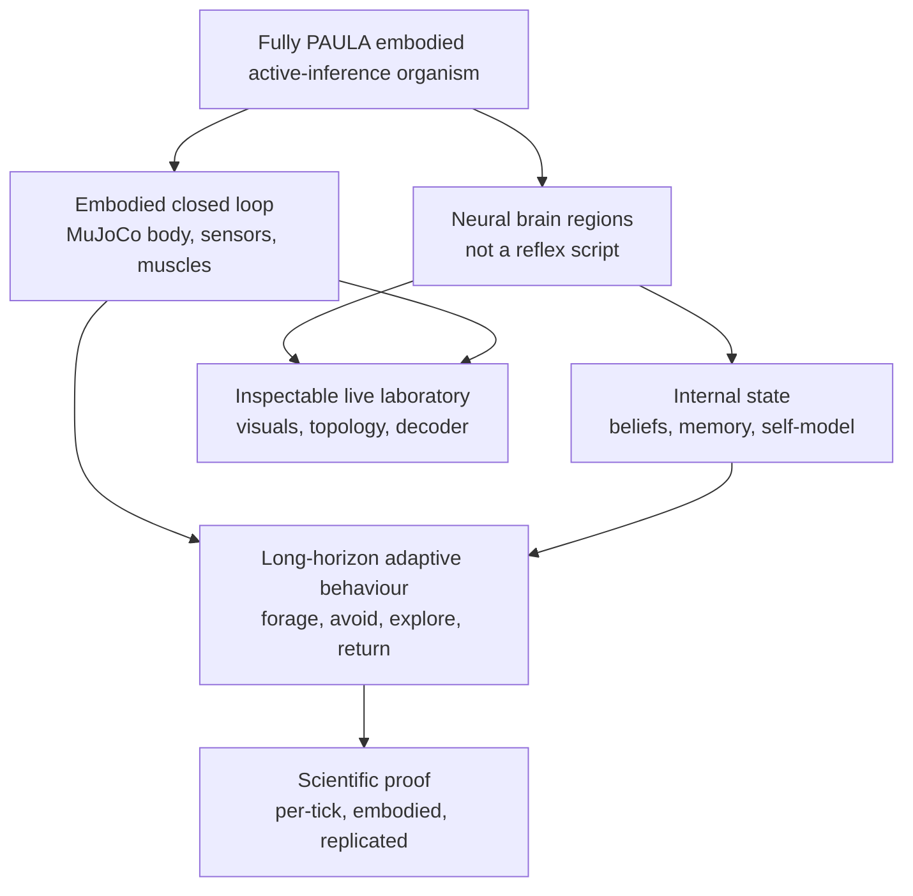

# Embodied PAULA active-inference research charter

## Purpose and authority

This is the durable statement of the user's research direction for the
embodied active-inference program.  It answers the question, “what are we
trying to build, under which scientific constraints, and what must be true
before we call it progress?”  It is a goal and acceptance charter, not a
status report and not a claim that its deliverables have already been met.
Use the [agent research-resumption guide](simulations/active_inference/RESEARCH_RESUMPTION.md)
for the evidence ledger and current blockers, and the
[provenance record](RESEARCH_PROVENANCE_AND_RESUME.md) for the recovery scope.

The charter is a normalized, exhaustive synthesis of substantive user goals
and research directions in the two July 2026 SNN-debug sessions.  It preserves
their hierarchy, later priority changes, and research standards without copying
raw conversations into a repository.  Repeated “continue,” progress-monitoring,
and scheduled-prompt messages are collapsed.  Source references such as
`4630:648` identify the user-message ordinal in session
`4630c9cc-ae60-4a85-a5da-88544a269fbb`, while `be7:024` refers to session
`be7dec7c-f6b9-4e48-b433-78e0ae71291c`; exact timestamps and session metadata
are retained in [the recovery index](docs/CLAUDE_SESSION_RECOVERY_INDEX.md).

## The north-star outcome

The program aims to build a genuinely embodied **custom organism** that is
richer than a reflex controller.  It must sense, learn, maintain internal
state, decide, move, and adapt in a physical MuJoCo world.  Its behaviour must
arise from a PAULA neural circuit assembly, including spiking and biologically
justified graded cells where needed, rather than from a Python policy, scripted
behaviour tree, ground-truth navigation shortcut, or external classifier that
secretly performs the cognitive task.  The intended organism should forage,
learn odour valence, navigate spatially, select actions among competing needs,
and eventually form and use an internal world/belief model in the
active-inference sense.  It must be inspectable while it runs, not merely
produce an attractive final trajectory.

Insect systems are references for individual circuits at this neural scale—for
example, central-complex, mushroom-body, and neuromodulatory mechanisms—but
they do not prescribe the organism's species, body plan, cognitive scope, or
final architecture.  The custom organism may combine evidence from insects and
other biological systems wherever the mechanism is appropriate.  This
clarification supersedes the original session's shorthand of an
“insect-brain-inspired” organism.  (`4630:648`, `4630:663`, `4630:664`,
`4630:788`, `4630:809`; current user clarification.)

The phrase “active inference” is substantive here.  The desired endpoint is
not merely a circuit that switches modes when a hand-authored condition is met.
The agent is expected to acquire or embody beliefs, a self/world model,
prediction-error-driven updating, and action selection that uses those states
in a complex world.  The discrete T-maze is a useful explanatory demonstration,
but it is not the endpoint; those functional roles must become neural and
embodied.  (`4630:663`, `4630:787`, `4630:788`.)

## Non-negotiable architectural constraints

| Constraint | Required interpretation |
| --- | --- |
| **PAULA is the cognitive substrate.** | The running brain is a PAULA network.  Permitted bridges are physical-field/body measurements to neural current, graded muscle membrane state to actuator force, and one-time symmetry-breaking/birth inputs.  Python may run MuJoCo, inject those sensor values, render, record, and decode; it must not choose the agent's behaviour. |
| **No hidden oracle.** | Absolute heading, object identity, scene anchors, a hand-coded “go home” policy, or a scripted action selector cannot enter as an unlabelled cognitive shortcut.  In particular, hardwired visual anchoring is not a learned spatial representation. |
| **Neural regions, populations, and wiring.** | Use circuit assemblies with meaningful populations and signed connectivity.  Functions such as sensory encoding, trend detection, valence, arbitration, shift, and motor control should not be reduced to a convenient Python scalar or a single-neuron placeholder when a population/circuit is required. |
| **Respect the shared substrate.** | `neuron.py` is shared, mechanism-sensitive infrastructure.  It is read in full before neuron-mechanism work and is not changed casually.  A parameterised, default-preserving change requires an explicit proposal and approval; later permission allowed weight bounds and a separate biologically grounded graded-current subclass, not an uncontrolled rewrite. |
| **Integrate; do not discard.** | Preserve and measure working components while extending the brain.  Consolidate code in `active-inference`, retain stable reference agents, and do not recreate progress in ephemeral scratch locations. |
| **The live interface is observational.** | Human-readable labels and controls may decode neural state, expose parameters, request a rebuild, or render topology.  The decoder must remain external and must not feed choices back to the network. |

These constraints were expressed repeatedly, including as the requirement that
the complete agent be “neural-network tick loop plus sensors signal injection
and muscle readout and nothing else.”  A proposed graded current cell is an
allowed research direction only because it remains a PAULA-derived neuronal
subclass and is motivated by a biological cell type; it is not permission to
move control into host-language code.  (`be7:024`, `be7:039`–`041`,
`4630:648`, `4630:759`, `4630:809`, `4630:811`, `4630:831`, `4630:989`.)

## Capability hierarchy and deliverables

The research hierarchy is deliberately broader than a single navigation score.
The lower levels must support the levels above them, while the final organism
must demonstrate that the pieces coexist without silently bypassing each
other.

| Level | Intended capability | Deliverable and acceptance direction |
| --- | --- | --- |
| **0. Embodied neural interface** | A MuJoCo body/world in which physical sensors feed PAULA and PAULA drives actuators through graded muscles and CPG/motor circuits. | Reproducible construction and a closed-loop trace showing that sensor input, neural dynamics, and actuator output remain the only behaviour path.  Bodies may be changed or expanded; tests must be long enough to expose drift and failure modes. |
| **1. Survival and motor primitives** | Sustained locomotion, odour-guided foraging, approach/avoid steering, exploration, and threat response. | Multiple long-horizon worlds, not a single food–home loop.  Record food/toxin contacts, paths, motor state, and the causal neural populations.  The desired behaviour includes nontrivial exploration and toxic-food avoidance. |
| **2. Associative value and interoception** | Antennal-lobe odour populations, mushroom-body sparse association/valence memory, lateral-horn innate valence, hunger/stress/reward modulation, and learning that changes action. | Demonstrate that value changes are synaptic and behaviourally consequential in the body, persist under continued relevant exposure, and may decay appropriately when exposure ends.  Inspect synapses as well as outcome trajectories. |
| **3. Spatial memory and navigation** | A vestibular heading representation, central-complex/ring dynamics, neural path integration, a home vector, homing, and eventually enemy/avoidance navigation. | Build and test the circuit first in isolation and then in the same embodied agent.  There is no arbitrary angular-error cutoff.  The system must track, integrate, and use spatial state as well as the implemented PAULA substrate reliably allows under valid embodied conditions.  Report the resulting fidelity, stability, failure envelope, and causal contribution to homing rather than declaring success from a preselected number. |
| **4. Arbitration and active inference** | A neural arbiter over foraging, home, explore, avoidance and related needs; beliefs, self-modeling, and a world model that influence action. | Show that neural state, not a Python conditional, produces the mode/action changes.  A component only counts when it changes the expected embodied outcome reliably. |
| **5. Perception and 3-D understanding** | A biologically grounded visual cortex whose retina-driven processing supports object recognition, abstraction, generalization, spatial understanding, and action. | This is a frontier capability, not licence for hand-built “sky cells,” object labels, or visual anchors.  Current user priority places primitive non-visual systems first; vision/learned anchoring resumes after those foundations unless an already-working visual component is simply preserved. |
| **6. Laboratory and communication** | A live, inspectable brain and a durable experimental record. | Interactive MuJoCo and brain views, complete topology/wiring, rebuild-gated subsystem controls, interpretable external status decoding, full recordings, trajectory/video artifacts, and documents sufficient to resume without agent memory. |

The original requested brain map named an antennal lobe, mushroom body, central
complex, lateral horn, winner-take-all/basal-ganglia-like action selection,
motor CPG, sensory transducers, and a MuJoCo body.  The later active-inference
direction adds belief state, self-modeling, and world modeling above those
primitive circuits.  These are architectural goals rather than evidence that a
specific biological homologue has already been faithfully recreated.
(`4630:648`, `4630:729`, `4630:737`, `4630:759`, `4630:787`–`790`.)

## Priority and dependency policy

The current scientific priority is to make the primitive embodied systems work
before treating vision as the next blocker.  Movement, sensorimotor closure,
valence learning, interoception, arbitration, heading, path integration, and
homing are the core dependency chain.  Vision and visually anchored homing are
important final capabilities, but were explicitly parked as frontier work when
they would obscure whether the core brain is functioning.  The correct
sequence is therefore to establish primitive circuitry in the body, then let
vision supply learned sensory content rather than use it as a shortcut.
(`4630:947`, with the longer-term vision objective from `4630:790`.)

Within spatial work, solve causal dependencies rather than repeatedly tuning
an endpoint.  A compass must receive a legitimate vestibular signal and stay
localized while updating.  Path integration must be shown with known inputs
and then in the moving body.  A home-vector circuit must drive the arbiter and
motor system before homing can be credited.  If a later stage fails, inspect
the earliest unverified dependency rather than attach another controller at the
output.  The documented current research status and the later gait/compass
corrections take precedence over historical hypotheses about a particular
low-flow or shift mechanism.  (`4630:759`, `4630:762`, `4630:766`,
`4630:872`, `4630:886`, and
[RESEARCH_LOG.md](simulations/active_inference/RESEARCH_LOG.md).)

## Evidence standard: what “working” means

A build, a short demo, a live visualization, an isolated spike raster, or a
single final number is not a completed subsystem.  “Effective” means that the
component performs its expected causal role reliably in the embodied agent.
Every accepted claim needs an explicit driving variable, the relevant neural
state and output, the physical outcome, a control or ablation, and a stated
failure criterion.

Per-tick traces are primary evidence.  They must retain neural tick and physics
tick time, true physical drivers such as heading, angular velocity and speed,
instantaneous population activity or appropriate graded state, sensor values,
actuator output, and geometry validity.  Examine latency, saturation,
transients, drift, variance, and the relationship between the time-varying
drive and response.  Whole-run percentages or a final wrapped angle may
generate a hypothesis but cannot establish the mechanism.  Test metrics on a
known-good and known-broken case before relying on them.  (`4630:875`,
`4630:876`, `4630:918`, `4630:959`, `4630:972`.)

Every circuit has two required test contexts.  First, test the circuit in a
high-fidelity isolated harness to establish its proposed mechanism.  Then test
the same circuit inside the real embodied agent, where fan-in, timing, sensory
refresh, motor coupling, and competing populations can invalidate an isolated
result.  Use multiple seeds and worlds over trajectories long enough to reveal
the relevant dynamics.  Choose the number of conditions, horizon, and staged
course correction from the mechanism and its observed variability, not from
arbitrary numerical quotas.  The scale should match the question: the user
repeatedly rejected 1k–4k ticks as evidence of long-horizon organism
behaviour.  (`4630:665`, `4630:817`, `4630:875`, `4630:959`, `4630:972`.)

For the maintained V1–V4 release gate, that general standard is operationalized
as an embodied matrix.  Each strict acceptance harness declares ten worlds in
simple-to-difficult order, and each world is replicated with five fixed seeds
(`11, 23, 44, 77, 101`).  The run horizon is not an arbitrary endpoint: when
omitted it is the maximum declared completion time of the selected world
catalog, and an explicitly shorter horizon is rejected.  All causal cases for
one world/seed share the same physical fixture, initial state, and horizon.
This 10×5 grid is the minimum evidence floor, not a claim that ten worlds
exhaust the organism's generalization envelope.  The matrix coordinator runs
independent suites in parallel processes, while each suite keeps its own
MuJoCo/PAULA state and is independently checked from raw per-tick traces.
Exploratory subsets remain allowed, but must be labelled non-protocol and
cannot support a version acceptance claim.

Each embodied record also preserves synchronized visual artifacts of the same
run: an agent-attached point-of-view video, a fixed world-frame third-person
video, and a top-down two-dimensional projection.  These are reviewable
artifacts, not behavioural inputs; capture is performed after the physical
post-tick observation and is independently checked for completeness.  A
missing or failed view is an evidence failure in a protocol run.

The research method is circuit-first and literature-first.  Before implementing
a biological circuit, identify the source and the specific connectivity fact:
cell types, projection direction, sign, spatial profile, and relevant
cross-organism trade-off.  Parameter sweeps are calibration tools after the
circuit is mechanistically plausible, not substitutes for its design.  Read
the complete neuron implementation before relying on a timing, plasticity,
refractory, attenuation, fan-in, or neuromodulation assumption.  Prove that a
knob actually changes the built network; identical output under a parameter
change is evidence of an inert or miswired parameter, not robustness.
(`4630:832`, `4630:875`, `4630:963`–`966`.)

## Required research artifacts

Each substantive run should preserve a parameter/configuration record, source
revision, environment/dependency information, seed, world/scenario, horizon,
and an output directory that does not overwrite the comparison run.  It should
produce compact per-tick data sufficient to replot the causal relation, plus a
short result record that says what was tested, what control was used, and what
the result does *not* establish.  For long or representative embodied runs,
preserve trajectory recordings and render both agent-centric and fixed-world
views when they aid inspection.

The live laboratory is a first-class deliverable.  It should expose safe
parameter changes, explicit rebuild-gated structural options, a topology that
matches the active structure, and an external decoder for hunger, belief-like
state, motor command, vestibular input, and other interpretable neural
quantities.  It must represent graded/non-spiking cells and their connections
as stateful neural components rather than hiding them because they do not emit
spikes.  It should stream the available neural information at the required
resolution rather than silently downsample the only evidence needed to debug a
circuit.  (`4630:817`, `4630:821`–`823`, `4630:951`–`957`.)

Maintain a current architecture record, research log, confidence-qualified
component status, and a source-to-artifact map.  The user specifically asked
for a master document that distinguishes verified-in-body,
verified-isolated-only, and assumed components, and records mistakes and their
prevention.  This charter supplies the goal layer; the operational evidence
layer belongs in [RESEARCH_RESUMPTION.md](simulations/active_inference/RESEARCH_RESUMPTION.md),
[ARCHITECTURE.md](simulations/active_inference/ARCHITECTURE.md),
[LAB_RULES.md](simulations/active_inference/LAB_RULES.md), and
[RESEARCH_LOG.md](simulations/active_inference/RESEARCH_LOG.md).
(`4630:875`, `4630:889`, `4630:947`, `4630:959`.)

## Normalized source-direction ledger

| Source statements | Normalized direction retained in this charter |
| --- | --- |
| `4630:648`, `654`, `663`–`665` | Build a nontrivial, visible, long-horizon embodied organism with intent, not a short reflex demo; it must eventually plan with an internal model. |
| `4630:692`, `723`, `729`–`730` | Finish and measure each circuit family before merely mounting it; favor population/circuit solutions, and solve attractor/reversal failures rather than avoiding them. |
| `4630:735`–`750` | Test multiple-food and toxin worlds, use long horizons and multiple scenarios, inspect learning synapses, and distinguish normal forgetting from forgetting under sustained exposure. |
| `4630:737`–`739` | Consolidate all working agent code in `active-inference`, preserve stable versions before iteration, then develop mushroom-body memory/planning to a clear outcome. |
| `4630:759`–`769` | Build a PAULA-only spatial-memory cortex using vestibular rather than absolute-heading input; improve the ring shift mechanism with sufficient neural population structure and study biological disorientation. |
| `4630:786`–`790` | Complete navigation, then pursue neural belief/self-model/world-model roles, a complex 3-D MuJoCo world, and true learned visual processing. |
| `4630:809`, `811`, `831`, `989` | Audit every behaviour path for hidden host-language control; preserve the shared neuron model, using only explicitly approved/default-safe biological extensions when necessary. |
| `4630:817`, `821`–`823`, `951`–`957` | Deliver an inspectable live system: long-run recordings, world and point-of-view renders, full 3-D topology, external neural-status decoding, parameter/rebuild controls, and structure-aware UI. |
| `4630:824`, `827`–`828`, `872` | Compare plausible biological circuit routes deeply, preserve measured working configurations, retest historical ones fairly, and integrate fixes into the actual live agent. |
| `4630:832`, `875`, `876`, `886`–`889` | Use literature-grounded circuit design, isolation-plus-embodiment testing, per-tick causal evidence, parameter-effect checks, parallel replicated runs, and a dependency-ordered status board. |
| `4630:918`, `959`, `972` | Treat long, multi-world, multi-seed, per-tick embodied measurements as the acceptance standard; course-correct at intermediate horizons instead of trusting a single summary. |
| `4630:947`, `963`–`968`, `975`–`984` | Prioritize core primitive functions over frontier vision, reread the full substrate before mechanism work, preserve learned methodological corrections, investigate root causes, and make time-scale assumptions explicit. |

## How to resume from this charter

Begin by reading this charter, then the current evidence/status guide and the
latest research-log entry.  Select the earliest unmet dependency in the
capability hierarchy, state the biological circuit hypothesis and its expected
causal trace, and create the isolated-plus-embodied experiment pair before
changing the agent.  Record the exact configuration, seed, world, and
per-tick channels at the start.  If a claim conflicts with the current
research log, preserve the historical statement as a hypothesis but follow the
newer measured correction.  Do not promote a UI demonstration, a successful
build, an isolated circuit, or a single aggregate score into evidence that the
organism has met its north-star goal.
