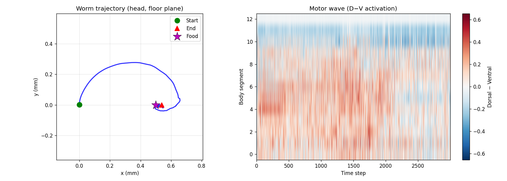

# Active Inference Sensorimotor Simulations

> **PAULA Paper:** [PAULA: A Computational Substrate for Self-Organizing Biologically-Plausible AI](https://al.arteriali.st/blog/paula-paper)
> **ALERM Framework:** [The ALERM Framework: A Unified Theory of Biological Intelligence](https://al.arteriali.st/blog/alerm-framework)
> **Neuron implementation:** [arterialist/neuron-model](https://github.com/arterialist/neuron-model)

A framework for simulating artificial life through active inference, where organisms are built from PAULA neurons wired by biological connectomes and embodied in MuJoCo physics environments.

## Architecture

```
Environment ──sensory stimuli──► Sensory Neurons (PAULA)
                                       │
                                 Interneurons (PAULA)
                                       │
                                 Motor Neurons (PAULA)
                                       │
                               Muscle Activations
                                       │
                               MuJoCo Body Physics
                                       │
                                  Body State
                                       │
                          ◄──── Environment Update
```

The PAULA neuron's prediction error (`E_dir = input − u_i.info`) drives two simultaneous processes:

- **Perception**: synaptic plasticity (`η_post × E_dir`) refines the generative model
- **Action**: motor neuron spikes drive muscles, moving the body to reduce future surprise

## Organisms

### C. elegans (`simulations/c_elegans/`)

**Connectome**: Cook et al. 2019 hermaphrodite (302 neurons)

- 83 sensory / 89 interneurons / 123 motor neurons
- 3,709 chemical synapses + 1,092 gap junctions

**Body**: MuJoCo articulated chain

- 13 rigid segments connected by hinge joints
- 48 actuators (4 muscle quadrants × 12 inter-segment joints)
- Contact dynamics for agar surface crawling

**Environment**: Circular agar plate

- NaCl and butanone attractant gradients (ASE/AWC chemosensory circuit)
- 2-nonanone aversive odour (AWB circuit)
- Nociceptive region (ASH circuit)

## Demo



_Left:_ Worm trajectory (head position) on the floor plane with food sources (purple stars). _Right:_ Motor wave (dorsal–ventral activation) across body segments over time.

## Quick Start

```bash
# Create virtual environment and install all dependencies
uv sync

# Pre-cache the connectome (runs once, ~8 s)
uv run python scripts/download_connectome.py

# Run a simulation (500 physics steps)
uv run python scripts/run_c_elegans.py --steps 500

# Run with a plot saved
uv run python scripts/run_c_elegans.py --steps 1000 --save-plot

# Run with food source close to start (stronger chemosensory signal)
uv run python scripts/run_c_elegans.py --steps 500 --food-x 0.005
```

The lockfile `uv.lock` is committed so environments are exactly reproducible across machines. `.venv/` is local and regenerated by `uv sync`.

## Project Structure

```
active-inference/
├── simulations/                  # Shared simulation engine
│   ├── engine.py                 # Tick-based SimulationEngine
│   ├── sensorimotor_loop.py      # Active inference loop + free energy trace
│   ├── base_body.py              # Abstract MuJoCo body interface
│   ├── base_environment.py       # Abstract environment interface
│   ├── base_nervous_system.py    # Abstract PAULA network wrapper
│   ├── connectome_loader.py      # Generic connectome → PAULA NeuronNetwork builder
│   │
│   └── c_elegans/                # C. elegans implementation
│       ├── simulation.py         # Factory: build_c_elegans_simulation()
│       ├── connectome.py         # Download + cache Cook2019 connectome
│       ├── neuron_mapping.py     # 302 PAULA neurons + CElegansNervousSystem
│       ├── body.py               # MuJoCo body wrapper
│       ├── body_model.xml        # MJCF worm model (13 segments, 48 actuators)
│       ├── environment.py        # Agar plate with chemical gradients
│       ├── sensors.py            # Sensory encoder (chem/touch/proprioception)
│       ├── muscles.py            # Neuromuscular junction model
│       └── config.py             # Biological constants
│
├── scripts/
│   ├── download_connectome.py    # Pre-cache connectome
│   └── run_c_elegans.py          # Main entry point
│
└── data/c_elegans/               # Cached connectome JSON
```

## Adding a New Organism

1. Create `simulations/<organism>/` with your organism's module
2. Download or define the organism's connectome as a `ConnectomeData` object
3. Call `build_paula_network(connectome)` to get a `NeuronNetwork`
4. Subclass `BaseNervousSystem`, `BaseBody`, `BaseEnvironment`
5. Create a `SimulationEngine` or subclass it (like `CElegansEngine`)
6. The `SensorimotorLoop` handles active inference framing automatically

## PAULA Neuron Model

Each neuron is a `Neuron` instance from `neuron-model/neuron/neuron.py`:

- **Inputs**: `PostsynapticPoint` objects with `u_i` (info, plasticity, neuromodulatory adaptation)
- **Integration**: leaky integrator `dS/dt = (−S + I_t) / λ`
- **Output**: spike when `S ≥ r` (primary threshold, neuromodulator-dependent)
- **Plasticity**: `Δu_i = η × direction × |E_dir|` (Hebbian with temporal polarity)
- **Retrograde**: error `E_dir` propagated back to pre-synaptic terminal

Active inference framing: `E_dir = input − u_i.info` is the prediction error. Minimising it over time means the neuron's weights converge to encode the statistics of its inputs — the organism's generative model.

## References

- Cook et al. 2019, _Nature_ — C. elegans hermaphrodite connectome
- Wang-Chen et al. 2024, _Nature Methods_ — NeuroMechFly v2 (Drosophila)
- BAAIWorm 2024, _Nature Computational Science_ — brain-body-environment model
