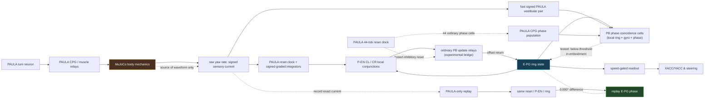

# Compass causal-boundary ledger

Status: 2026-07-31. This is a diagnostic record, not a claim that path
integration or homing has been solved. The visual cortex remains outside this
ledger.

## What recurrence is buying us — and what it is not

The requirement is **a remembered heading state**, not recurrence in itself.
After a turn has stopped, the state must remain available to the speed-gated
path-integrator and steering circuits; while turning, it must be translated by
signed angular velocity. A localized recurrent E-PG bump is one biologically
motivated way to get that state: local recurrence holds the bump and the
P-EN loop moves it. In fly data, P-EN neurons are conjunctively tuned to
heading and angular velocity and their bump offset changes with turns
([Turner-Evans et al., 2017](https://elifesciences.org/articles/23496)).

That does **not** mean this implementation must use a recurrent ring. Viable
all-PAULA alternatives worth comparing as separate hypotheses are:

1. A circular gated shift register: one locally persistent column is handed to
   a neighboring column by a signed, CPG-gated P-EN population. The circular
   hand-off loop is still recurrent at the network boundary, but it is not an
   E-PG attractor and has a different failure mode.
2. A distributed graded heading accumulator: each direction column has an
   ordinary PAULA leaky membrane memory; a winner-take-all/interneuron sheet
   localizes the result. The memory lives in cellular membrane state rather
   than E-PG-to-E-PG recurrence.
3. A neural delay-line / phase-code population coupled to a landmark
   re-anchoring circuit. It is useful as a short-horizon velocity integrator,
   but a full 360° persistent heading ultimately needs either a circular
   recurrence, a long delay line, or a stored graded state.

The first two are falsifiable alternatives, not fallback Python controllers.
They should be evaluated with the same per-tick embodied/replay protocol
before being considered for the organism.

## Test strata and current matrix

`Pass` means the stated observable was demonstrated. `Partial` means a
sub-mechanism works but the behavioral requirement has not been met. `Fail`
means the trace rules out the required behavior. `Unproven` is deliberately
not promoted by a plausible circuit diagram.

| Circuit / mechanism | Isolated circuit or synthetic drive | Whole PAULA, no biomechanics (virtual/replay) | Embodied MuJoCo | Current causal interpretation |
|---|---|---|---|---|
| CPG → PAULA muscle relays | Pass: ordinary PAULA rhythm and graded outputs | Pass | Pass: drives locomotion/turns | Provides the raw periodic load that the compass must tolerate. |
| Food gradient / collection | Pass | Pass | Pass | Core food-seeking is observed in the live agent. |
| Toxin gradient / head-on TRISE escape | Pass | Pass | Pass | Core toxin avoidance is observed in the live agent. |
| MB counterconditioning → AVOID → LH turn | Pass | Pass | Pass | Learned food avoidance is expressed through the neural motor route. |
| FORAGE → EXPLORE arbiter | Pass | Pass | Pass | The mode transition produces the search behavior. |
| E-PG ring persistence (hold) | Pass for the present live ring | Pass | Partial: ring remains live through the long turn | Persistence is not enough; the ring can stay active while encoding the wrong heading. |
| Direct P-EN → ring offset mechanism | Pass for direction and sustained activity | Pass | Partial | Direct injected P-EN drive establishes that the ring can translate, but does not calibrate physical yaw. |
| Raw-gyro PAULA transducer with constant rate | Direction/activity pass | Direction/activity pass | N/A | It does not test the gait-shaped waveform or the body-to-sensor boundary. |
| Strict CPG/reset gyro buffer → P-EN | Pass as an ordinary PAULA circuit | **Fail for accuracy** on raw-body replay | **Fail for accuracy** | It keeps the ring alive, but cannot consistently translate it by body yaw. No special sample/hold cell is used. |
| PB opponent update bridge, initial timing | **Partial:** live and signed under fixed drive (+43.1° / −95.9°) | **Fail for accuracy:** exact raw-body replay has the same phase slips | **Fail for accuracy:** body −122.0°, ring −46.5° | The slow residual accumulates, but this first version had one unaccounted relay tick relative to direct `d_push=4`; do not generalize it to PB topology. |
| PB bridge, latency-matched relay + reset | Pass for fixed current (+55.0° / −136.1°) | **Fail for accuracy:** exact replay reproduces the under-driven ring | **Fail for accuracy:** commanded course body −80.80°, ring −38.72° | Correcting the one-tick relay delay removed the timing confound; the reset then suppresses PB output too strongly at the sampled boundary. This topology/parameterization is rejected, not the entire PB/EB hypothesis. |
| PB CPG-phase coincidence gate, narrow selectivity | Partial: live, signed but weak (+4.7° / −28.2°) | **Fail:** ring course 0.0° | **Fail:** ring course 0.0° for body −80.80° | Full ticks show no PB gates cross 2.10 during the real yaw waveform (peak membrane 1.98). Replay equality is 0.000°, so this is an input-scale/selection failure inside the circuit. |
| PB spatial-gain correction to the phase gate | **Fail:** 20,390 PB spikes in the fixed-current harness, both directions; no ring motion | Not advanced | Not advanced | Increasing the local E-PG term to cross the embodied threshold destroys spatial/directional selectivity. A gain/threshold sweep cannot repair this gate geometry. |
| Full E-PG/P-EN compass long physical turn | N/A | **Fail**: exact raw-gyro replay reproduces the same ring | **Fail**: body −80.80°, ring −56.80° during the commanded course | The source waveform comes from embodiment, but no hidden pose, host heading, or other body state is required after the gyro current reaches PAULA. |
| XACC/YACC / Stone PI expression | Pass only when heading is supplied externally | Partial | Partial | It is a downstream expression/readout, not evidence of self-maintained heading or homing. |
| Closed-loop PI homing | Unproven | Unproven | **Not accepted** | Depends on the failed compass state estimate. |

The source-of-truth per-tick bundle is generated by
[`experiments/compass_replay_bundle.py`](experiments/compass_replay_bundle.py).
It records both sides of the comparison instead of comparing period summaries.

## The measured boundary result

The strict candidate uses an ordinary recurrent PAULA reset-clock and two
ordinary graded signed integrators, then the existing local P-EN coincidence
neurons. It is intentionally **not** the earlier experimental phase
sample/reset/hold neuron.

For the 400-tick commanded physical turn, the generated bundle reports:

| Measurement | Value |
|---|---:|
| Physical body yaw | −80.80° |
| Ring phase change | −56.80° |
| Turn-course tracking error | +24.00° |
| Embodied vs PAULA-only replay phase difference, mean / max | 0.000° / 0.000° |
| 44-tick blocks where ring moves against body | 3 |

The same raw gyro sample is written to the replay PAULA port immediately
before the matching neural tick. Both E-PG phase streams are therefore
bit-identical under this run. This is a causal **cut**: physics creates the
input waveform, but neither physical pose, motor feedback, host filtering,
nor a whole-brain handoff is the immediate source of the wave reversals.

The turn is more stable than it initially appeared when viewed only as raw
instantaneous yaw. Once the turn has settled, consecutive 44-tick windows
have nearly the same body yaw (about −9.34° each), reset-clock event spacing
is exactly 44 ticks, and raw-waveform cosine similarity to the first settled
stroke is 0.9974. The signed reset outputs also settle (CW about 70.98 versus
CCW about 19.18 integrated release per stroke). Yet the ring's consecutive
44-tick changes include −38.05°, **+5.47°**, −12.89°, **+7.76°**,
**+10.82°**, and −1.31°.

That localizes the active failure to the delayed recurrent P-EN↔E-PG dynamics:
a near-periodic, directionally biased input produces phase slips in the
travelling wave. A 44-tick P-EN count is insufficient to predict the next
ring displacement; it loses the ring's spatial phase and the delayed
synaptic-arrival phase. The existing `d_push=8` loop is also not phase-locked
to the 44-tick gait/reset period (`44 mod 8 = 4`). The matched-gain sweep is
now complete for seed 11:

| `d_push` | Body yaw | Ring yaw | Error | Verdict |
|---:|---:|---:|---:|---|
| 4 | −122.0° | −92.9° | +29.2° | Better than 8, but still wrong and non-monotonic. |
| 8 | −122.0° | −59.2° | +62.9° | Baseline phase-slipping candidate. |
| 11 | −122.0° | +24.1° | +146.1° | Reversed. |
| 22 | −122.0° | −6.4° | +115.7° | Nearly pinned. |

So short-delay phase alignment matters—the 4-tick condition improves the
single-seed result substantially—but divisibility by 44 is plainly not a
sufficient explanation or an acceptance result. It needs a multi-seed replay
comparison and a controlled bridge/buffer redesign rather than another blind
delay sweep. Its matched PAULA-only replay has the same result as the baseline
boundary test (0.000° phase difference) and still contains four reversal
blocks, so the improvement is a property of the candidate circuit under the
raw body waveform, not an extra embodied pathway.

## Explicit PB/EB bridge: initial transfer trace and latency audit

The proposed bridge has now been built as named, ordinary PAULA populations:
P-EN CL/CR columns feed bilateral PB update relays; the relays feed the
one-column-offset E-PG targets.  The optional maintenance route is separately
E-PG → bilateral PB maintenance tracts → P-EG → same E-PG column.  These are
actual synapses and membranes in the topology, not labels on a direct edge;
they can be enabled in the live topology viewer with `pb_eb_bridge`.

The isolated whole-compass harness is a genuine but narrow prerequisite pass.
With the 22-tick ordinary PB membrane and local opponent dendrites, a fixed
CCW then CW PAULA gyro current kept the ring live for 0.998 of ticks and
moved it +43.1° then −95.9°.  The PB update population fired, so this is not a
silent-relay null.  It was therefore advanced to the recorded-body gate.

The *initial timing implementation* failed there.  In the sustained embodied course the physical body turns
−122.0° while the ring turns only −46.5°.  During the commanded interval it
turns −80.80° / −36.60°, with two 44-tick reversal blocks.  The corresponding
full-tick raw-gyro replay has 0.000° mean and maximum phase difference from
the embodied ring, so a missing mechanical or whole-brain state is not the
reason the bridge fails.

The PB release trace identifies a mechanism worth preserving.  At successive reset-boundary
samples in the right turn, the CL/CR population releases were 99.6/69.1,
67.1/114.1, 24.4/151.6, 17.7/161.4, and 12.3/205.0; later CR release reaches
about 231.  The residual thus changes from a useful local directional
difference into a large, persistent one-sided E-PG drive.  The ring then
stalls and sometimes moves opposite the already stable body stroke.  An
ordinary inhibitory synapse from the existing 44-tick PAULA reset clock was
the directly motivated repair attempt, not a sample/hold extension.  At gain
8 it bounded some early PB release but still rose from roughly 45.8 to 149.8,
and the full raw replay remained exact (0.000° phase difference), with
−80.80° body versus −39.07° ring during the course.  Gain 16 made the
full-course error worse.

However, a subsequent minimal PAULA impulse audit found a comparison error:
the PB relay consumes one neural update tick between incoming and outgoing
dendritic delays.  The initial builder made the two dendritic distances sum
to `d_push`, so every bridge candidate arrived **one tick later** than its
direct `d_push=4` control. The corrected bridge makes their sum `d_push - 1`
and [`pb_eb_bridge_latency.py`](../../experiments/pb_eb_bridge_latency.py)
asserts matched direct/PB arrival.

The corrected, reset-gated comparison is now complete and still negative:
the fixed-current isolated circuit is live and signed (+54.98° / −136.06°),
but the 400-tick commanded body course is −80.80° while the ring moves only
−38.72° (error +42.08°; two reversal blocks). The raw-gyro replay matches
the embodied E-PG phase at every tick (0.000° mean and maximum difference).
This cleanly rejects this *latency-matched, reset-gated parameterization*;
it does not reject the broader PB/EB anatomical hypothesis. Full-tick PB
release shows the reset drives the sampled relay release near zero late in the
course, so the original accumulation problem has become under-drive rather
than a hidden body integration failure.

## Explicit CPG-phase PB gate: a resolved transfer boundary

The user-rejected sample/reset/hold subclass remains diagnostic-only. The
replacement tested here is a different, ordinary-PAULA hypothesis: 44 normal
CPG-phase interneurons, two capped signed graded vestibular afferents, and 72
ordinary spiking PB coincidence cells. Each PB cell has only local E-PG,
signed vestibular, and a three-cell CPG-phase window on dendrites. The phase
population chooses the stable negative-yaw lobe from the full raw trace
(physical phases 14–20; phase 15 is about −29.44 raw yaw units). There is no
Python phase counter, heading calculation, sample, hold, or special neuron
state.

This is biologically motivated rather than claimed faithful: central-complex
P-EN feedback is anatomically phase/offset structured, and locomotor sensory
feedback is often phase-gated, but these exact PB weights and the 44-tick
mapping are an experimental neural mechanism ([Hulse et al., 2021](https://elifesciences.org/articles/66039/figures);
[Danner et al., 2022](https://pmc.ncbi.nlm.nih.gov/articles/PMC9159344/)).

The transfer result is precise. Under a constant ±4 isolated current, the
selective gate is live and produces opposite movement (+4.74° / −28.15°),
with 175 PB gate spikes. Under the actual body waveform, however, no PB phase
cell spikes in either direction: its largest membrane value is 1.98 versus a
2.10 threshold. The ring therefore changes 0.00° while the body changes
−80.80°. The no-body replay receives the exact same raw rate before each
neural tick and is exactly identical to the embodied phase trace.

This is not merely “the body is jittery.” The selected negative-yaw lobe is
stable across the settled 44-tick strokes; the issue is that the embodied
E-PG output reaching a single PB gate is only about 0.037 membrane units above
background at the selected tick. A measured spatial-gain correction (local
E-PG weight 0.7→4.0, threshold 2.10→2.08) was deliberately tried once. It
caused 20,390 PB spikes in the isolated fixed-current case—including both
directions—and zero signed ring movement. Thus the present one-cell-per-column
gate cannot distinguish local bump contrast from background at the PAULA
signal scale. This is a topology/representation limit, not an argument for a
hidden smoothing scalar or a gain sweep.

## Causal model used for investigation

The dashed equality edge is evidence against an unlogged embodied-to-brain
edge downstream of the gyro. It does *not* prove the gyro transducer is good:
it proves the same candidate fails in both conditions.

## Anatomically grounded topology work

The current direct E-PG recurrence plus delayed P-EN offset is a compact
functional model, not a literal protocerebral-bridge (PB) / ellipsoid-body
(EB) reconstruction. The reset-gated bridge and phase-gated PB alternatives
now have clean, full-tick negative outcomes: the former becomes under-driven
after timing correction; the latter cannot preserve spatial selectivity at
the embodied E-PG signal scale. The next anatomy-inspired candidate needs:

- separate offset P-EN paths for update and a zero-offset P-EG maintenance
  path;
- structured lateral inhibition in the PB rather than a single global
  inhibitory cell acting directly on E-PG; and
- one tested phase relation at a time, not an added set of hidden delays.

This is biologically motivated by evidence that P-EG pathways stabilize
insect heading circuits under P-EN/E-PG synaptic imbalance
([Pisokas, Heinze & Webb, 2020](https://elifesciences.org/articles/53985))
and by the Drosophila central-complex connectome's much richer recurrent and
reciprocal motifs ([Hulse et al., 2021](https://pubmed.ncbi.nlm.nih.gov/34696823/)).
It is not constrained to copying one organism: mammalian head-direction and
other insect circuits can motivate the *functional* separation of maintenance,
velocity update, competition, and landmark correction. Any such topology
remains a hypothesis until it passes the same replay and embodied gates.

I also ran the current **direct** P-EG maintenance relay beside the 4-tick
candidate. The low-gain version was an important null: it produced exactly
zero P-EG spikes in 1,400 ticks and therefore an exactly unchanged trace. A
suprathreshold version was active (4,809 P-EG spikes over 1,286 ticks) but
worsened the embodied error from +29.2° to +79.8°. This rules out neither
P-EG biology nor PB/EB bridge topology; it rules out treating the current
same-column delayed relay as though it supplied the missing bridge geometry.

## Falsifiable next experiments

1. **Confirm the 4-tick lead.** Run its raw-gyro replay and several seeds;
   accept it only if it reduces phase-slip blocks *and* improves body-vs-ring
   tracking consistently. The single-seed body result is promising, not a
   completed compass.
2. **Build spatial contrast before phase gating.** A PB phase gate needs a
   local-bump / background separator (for example a small E-PG contrast or
   PB lateral-inhibition population), not a stronger copy of the existing
   ring output. Its preflight must show inactive-column membrane below
   threshold, active-column membrane above it, and one signed PB pulse per
   selected phase in both isolated and recorded-body input.
3. **Buffer as population, not special counter.** Compare ordinary PAULA
   short/medium/long signed integrator populations with inhibitory competition
   and an explicit CPG reset. Report whether their replay gain and phase lag
   stay stable under the measured 44-tick waveform.
4. **Alternative heading memory.** Implement the circular gated shift-register
   as a separate PAULA circuit. It must hold, turn both ways, reverse, and
   survive the recorded gyro before it is allowed to drive PI.

For every candidate, preserve the three-column outcome—isolated,
PAULA-only replay, embodied—and mark a negative transfer rather than tuning
until it appears to work.
