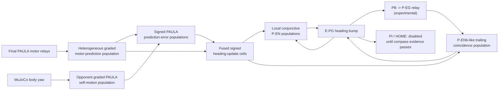

# Separate sensorimotor-compass programme

Status: experimental and opt-in. This document describes versioned new agent
variants, rather than a replacement for the working demonstration agent. It is
a circuit-design record and a set of falsifiable experiments; it does not
claim that its PAULA populations are a faithful reconstruction of any single
animal. V1 is retained as a trace-backed negative control. The current
candidate is `SensorimotorEstimatorV2Agent3D`.

## Biological rationale and scope

The existing compact compass asks one delayed P-EN-to-E-PG travelling wave to
preserve a heading bump, initiate a turn update, determine its gain, and stop
the update. That is a stronger burden than the biological evidence warrants.
In *Drosophila*, E-PG-like heading activity persists in a recurrent circuit,
while P-EN populations conjunctively encode heading and self-rotation and use
spatially offset PB-to-EB projections that can move the heading representation
([Turner-Evans et al., 2017](https://doi.org/10.7554/eLife.23496)). The
central-complex connectome contains additional recurrent, sensory, motor and
state-dependent routes rather than one generic feedback edge
([Hulse et al., 2021](https://doi.org/10.7554/eLife.66039)).

The relevant biological claim is therefore modest: a useful heading system
should combine motor-related and sensory self-motion evidence, maintain a
state between observations, and eventually correct accumulated error from
learned external cues. Separate P-EN timing classes support the idea that
leading update and trailing/stabilising roles should not be collapsed into a
single wave, although calling either class a literal “gas pedal” or “brake”
would overstate the evidence ([Green et al., 2017](https://doi.org/10.1038/nature22343);
[Turner-Evans et al., 2020](https://doi.org/10.1016/j.neuron.2020.08.006)).
Motor-related signals can convey a copy of self-generated action, but they do
not make sensory feedback unnecessary; fly visuomotor pathways demonstrate
efference-copy-like signals alongside sensory motion processing
([Kim, Fitzgerald & Maimon, 2015](https://doi.org/10.1038/nn.4083)).

The simulator yaw-rate port is consequently a generic physical self-motion
sensor, not a claim that walking flies have a single literal vestibular channel.
The candidate does not receive pose, absolute heading, a target bearing, a
host-computed residual, or a Python action choice. Python only places the
physical yaw measurement on declared external PAULA sensory ports and maps the
existing PAULA muscles to MuJoCo force.

## Circuit hypothesis

The motor-prediction population reads the final spiking paddle relays, the
last spiking stage before graded muscles. It is deliberately not driven only
by the older TL/TR turn cells, whose activity is an intention-like steering
signal and was measured not to be a reliable realised-yaw proxy in this body.
Several ordinary graded PAULA cells with distinct membrane constants represent
the prediction at fast, medium, and slow time scales.

V1 attempted to give a delay-line residual cell raw *signed* yaw current.
The full-tick audit exposed a PAULA interface constraint: an input-buffer row
is propagated only when `info > 0`. A negative external `info` value is
therefore absent, not an inhibitory observation. Its apparent CCW sensory
release during a physical CW course was an artefact of that one-sided
representation, not a valid signed residual. This is why V1 remains in the
repository and the results rather than being silently retuned.

V2 makes the physical interface explicit: Python supplies only two
non-negative currents, `max(yaw, 0)` and `max(-yaw, 0)`. Each PAULA sensory
cell receives its own direction on an excitatory dendrite and the opposite
direction on an inhibitory dendrite. Four ordinary leaky cells per direction
(`lambda = 6, 12, 24, 48`) make a heterogeneous self-motion population; no
host-side smoothing, subtraction, heading estimate, or action choice is
introduced. Thus a negative synaptic weight, rather than a negative external
`info`, represents inhibition.

The paired prediction-error cells implement the two rectified halves of the
signed residual with ordinary excitatory and inhibitory dendrites:
`e_CCW = sensory_CCW - sensory_CW - prediction_CCW + prediction_CW`, and
`e_CW = -e_CCW`. The fused update receives the signed motor prediction and
*both* error halves, so a CW correction both strengthens the CW update and
suppresses the CCW update. This differs from V1, which could add a
same-signed error while leaving the competing prediction active. Thus motor
prediction can compensate latency, while sensory evidence can correct a wrong
prediction without an external estimator.

This first version deliberately leaves the existing Δ7/broad-inhibition ring
mechanism in place. It does not yet implement the distinct P-EG→P-EN2 trailing
stabiliser or a learned ER-like landmark map. Those are next structural
questions, not knobs to switch on before the fused update demonstrates a
causal advantage. When visual correction returns, it must be learned and
cue-dependent; experience-dependent remapping of visual heading input is
biologically supported, while the current `SUN_AZIMUTH` lookup is not an
acceptable substitute ([Fisher et al., 2019](https://doi.org/10.1038/s41586-019-1772-4)).

## Separate-agent boundary

`sensorimotor_agent3d.py` selects this topology with explicit defaults. The
normal `AIFAgent3D`, live demo, default configuration, and existing accepted
food/toxin/motor circuits are unchanged. The new agent retains those circuits
only to make later embodiment tests realistic; it does not wire its uncertain
heading into path integration, HOME selection, or navigation acceptance. The
new full-tick runner, `experiments/sensorimotor_compass_probe.py`, delivers a
current to the normal PAULA TR turn neuron, records the actual motor-relay
prediction and raw physical yaw, and records every E-PG, P-EN, residual,
prediction, and fused-update state.

## Evidence policy

The programme retains strict causal constraints but relaxes the inappropriate
“perfect yaw encoder” target. It must show a persistent single bump, correct
average signed response, no repeated counter-rotation during a sustained
course, and a bounded short-horizon embodied error distribution across seeds.
The full-tick no-body replay remains a diagnostic cut: it establishes whether
an observed failure is already present after the yaw current enters PAULA. It
is not an expectation that a biological heading representation equal physical
yaw on every tick.

The immediate causal comparison consists of intact fusion, a prediction-path
ablation, and a sensory-path ablation. The body and turn-neuron stimulus must
remain active under both ablations. A useful first result requires that the
fused PAULA update is non-silent, that the two source populations are actually
different during the real turn, and that removal of either branch changes the
heading outcome in the predicted direction. It still does not establish path
integration or homing. Only after that comparison should a separate
P-EG/P-EN trailing stabiliser, confidence-to-PI gate, or learned landmark
correction be added.

The initial V1 ablations cannot satisfy that criterion because V1 had the
one-sided signed-input defect. The corrected V2 has now received the same
three full-tick cuts at the latency-matched `lambda=44`, `d_push=3` baseline:

| V2 cut | Physical yaw | Ring yaw | Mean CW fused update | What it says |
| --- | ---: | ---: | ---: | --- |
| intact | -80.80° | -20.26° | 0.0814 | Both declared PAULA sources and the P-EN projection are active. |
| prediction weight = 0 (sensory path only) | -80.80° | -20.26° | 0.0698 | The corrected opponent sensory path is independently sufficient to launch this limited response. |
| sensory weight = 0 (motor-prediction path only) | -80.80° | -19.71° | 0.0129 | Final-relay efference copy is also independently sufficient on this deterministic course, despite being much weaker. |
| P-EN projection gain = 0 | -80.80° | 0.00° | 0.0814 | The ring does not drift through this course: its motion requires the declared fused-update-to-P-EN path. |

The corresponding artifacts are
`sensorimotor_compass_v2_lam44_dpush3_seed11_ablation_prediction.json`,
`sensorimotor_compass_v2_lam44_dpush3_seed11_ablation_sensory.json`, and
`sensorimotor_compass_v2_lam44_dpush3_seed11_ablation_pen_projection.json`.
Each retains all 1,400 tick rows. This establishes causal *sufficiency* of
each input for the current stereotyped turn and causal *necessity* of the
P-EN projection, but it does **not** show that fusion gives an additive or
robust advantage. The near-identical endpoint with either source alone is a
further demonstration of the ring's threshold/hysteresis: each source can
trigger a limited shift, while adding the second source currently does not
carry the bump farther. The next interventions should target this recurrent
transfer regime and cue-conflict/reversal tests, not claim a solved
sensorimotor estimator.

## Versioned full-tick evidence

All numbers below are from the declared 1,400-tick embodied `TR` course
(settling through tick 199; turn current ticks 500--899) in
`experiments/sensorimotor_compass_probe.py`, seed 11. The record contains a
row for every neural tick, including physical yaw, raw yaw current, all four
sensory and prediction cells per direction, both errors, both fused updates,
P-EN counts, and the E-PG raster. These are diagnostics, not acceptance
claims.

| Variant | Physical yaw | Ring yaw | What the tick trace establishes |
| --- | ---: | ---: | --- |
| V1 intact | -80.80° | -7.71° | Motor prediction favoured CW but the one-sided delayed sensory route released only CCW. |
| V1 no prediction | -80.80° | 0.00° | The malformed residual alone supplied no valid update. |
| V1 no sensory path | -80.80° | -15.85° | Relay prediction alone supplied the only signed movement. |
| V2, update `lambda=4` | -80.80° | -16.38° | Mean sensory and motor signed differences both favoured CW; rapid stroke phases still made both rectified error halves active. |
| V2, update `lambda=44` | -80.80° | -15.85° | A full-stroke ordinary PAULA membrane suppresses the competing CCW fused output, but has not yet increased the ring's transfer gain. |
| V2, latency-matched `d_push=3` | -80.80° | -20.26° | Removing the one extra source-to-P-EN transport tick improves the correct-sign response, but remains under-gained. |
| V3, discrete four-phase leading population | -80.80° | -3.57° | The ordinary CPG coincidence gates emit, but sparse phase pulses make the bump jitter rather than propagate. |
| V4, leaky four-phase leading population | -80.80° | +13.62° | Ordinary leaky phase overlap becomes too broad and causes counter-rotation; it is rejected. |
| V5, explicit PB/P-EG bridge (PB→P-EG = 0.8) | -80.80° | -20.26° | Maintenance PB cells release, but P-EG remains silent; this is a silent-path control, not evidence for stabilisation. |
| V5, explicit PB/P-EG bridge (PB→P-EG = 1.6) | -80.80° | -16.68° | P-EG is active on 268/400 turn ticks (mean 2.47 population release), but adds reversal blocks and degrades V2's correct-sign response. |
| V6, spatial P-EG→P-ENb trailing route | -80.80° | -20.26° | The first summed-threshold implementation was silent. Its inherited leaky PAULA coincidence revision releases on all 400 turn ticks (426.29 total P-ENb release) but has no measurable ring effect at its deliberately small return weight. |
| V7, four-copy heterogeneous P-ENa scale-up | -80.80° | -24.63° | Four added local PAULA copies per column/direction (velocity traces 1/2/4/8 ticks) are active on all turn ticks and improve the correct-sign response by 4.37°. |
| V7, doubled micro-bank return | -80.80° | -15.42° | Doubling only the added-bank return conductance reverses the improvement without killing the ring: scale response is nonlinear and cannot be replaced by a global gain. |

V2 is therefore a real representational correction and a better causal
foundation, not a solved compass. It shows that the remaining error is not
the old sign-loss bug: the ring currently under-responds to an already
correct-sign fused update. The isolated recurrent mechanism makes this
nonlinearity concrete: a steady direct CW P-EN current of 0.08 moved the ring
only -0.76° in a 200-tick test, 0.20 moved it -2.58°, 0.50 moved it -60.52°,
and 0.75 ran it to -213.23°. The embodied fused source averaged 0.081 CW.
It is therefore neither valid nor sufficient simply to multiply a final
synapse: the physical path also changes the timing relative to the moving
bump.

V3 and V4 are retained trace-backed rejections. V3 proves that an explicit
PAULA CPG coincidence population can be built without a sample/hold subclass;
V4 proves that its first-order leaky extension does not by itself repair the
wave. V5 advances the separate P-EG/P-ENb-like stabiliser from design to a
real, visible PB/P-EG tract and rejects its initial embodied parameterisation:
the silent-path control establishes its low-gain absence, and the active-path
control establishes that merely activating it produces a competing delayed
loop. V6 completes the next structural cut: its P-ENb route is a distinct
spatially offset population with local P-EG and the same PAULA fused-update
sources as the leading route—there is no direct same-column P-EG return. It
uses the existing `ConjunctiveGradedNeuron` inheritance path with ordinary
leaky dendrites to tolerate sparse P-EG versus graded update timing. That is
a biologically motivated *phenomenological* neuron option, not a claim of a
faithful cellular P-ENb model. Its activation without behavioural effect is
not grounds to increase a trailing/braking pathway while the leading path is
already under-gained. No variant may feed this unaccepted heading into PI,
HOME, or navigation.

V7 tests population scaling without changing the physical interface: it retains
V2's motor/sensory fusion and original P-ENs, then adds four local
P-ENa-like PAULA copies per heading column and direction. Each copy receives
only local E-PG and the fused PAULA update, but has a distinct local velocity
trace (`tau=1,2,4,8`). In the full embodied TR trace this bounded scale-up
improves ring rotation from `-20.26°` to `-24.63°`; its 288 added cells release
on all 400 turn ticks. That is a real, small correct-sign component result,
not an accepted compass. A deliberately doubled return conductance degrades
the response to `-15.42°` while the ring stays alive, reproducing the
nonlinear recurrent-interface constraint in a different form. The working
rule is therefore: add independently timed local population members and test
their bounded contribution; do not treat neuron count as a scalar gain knob.

## Parallel engineering representation experiment

The four-level “cylinder” candidate is intentionally separate from the
biology-inspired estimator. It uses four quaternary PAULA state rings as
digits of a 256-state circular counter, giving 1.40625-degree quantisation.
Only the lowest digit receives signed sensory current; ordinary PAULA carry
cells propagate 3→0 and 0→3 wraps upward. This tests whether explicit
coarse-to-fine carry logic can preserve precision and reversals without asking
a single continuous ring to represent every scale.

There is no evidence that the fly central complex is literally a four-digit
base-four counter. The cylinder is therefore an engineering representation
hypothesis, not a biomimetic claim. Its isolated acceptance must be followed
by the identical raw-yaw replay and embodied tests, including carry behaviour
at real gait-induced boundary crossings. It can improve representational
quantisation, but it cannot by itself solve sensorimotor calibration or give a
counter a valid physical update signal.

The isolated counter itself passes zero-drift hold, +68-bin advance, -68-bin
reversal, and exact recovery, with expected carry vectors `[17, 4, 1]` in each
direction. It has now also passed a strictly separate **fixed replay**
extension. Two biased opponent graded PAULA receptor currents (`45 ± raw_yaw`)
feed PAULA signed accumulators, PAULA refractory event doublets, and then the
counter gates. Python supplies the recorded scalar yaw observation only: it
does not threshold events, integrate yaw, decode a state for feedback, or
write a heading. On the body-generated TR trace (−80.80°, −57 expected bins)
the trace-calibrated transducer produces −56 bins. Without changing it, an
independently generated TL trace (+84.62°, +60 expected bins) produces +61
bins. Both have 100% turn-period decode coverage.

That is promising replay evidence but still not a generalisation or embodied
acceptance: the baseline continuous transducer produced only −7 bins on the
TR trace, and the passing transducer was calibrated against that trace. The
opposite-direction trace is the meaningful limited holdout; a seed-29
fixed-turn source was byte-identical and is not counted as independent. A
near-equal-count flat control (80 neurons versus the cylinder's 78) retains
sign but grossly over-rotates at its 20-degree resolution (TR −8 versus −4
expected bins; TL +9 versus +4). The cylinder therefore appears more stable
and precise under these two replays, not biologically validated or yet capable
of closed-loop body control.
