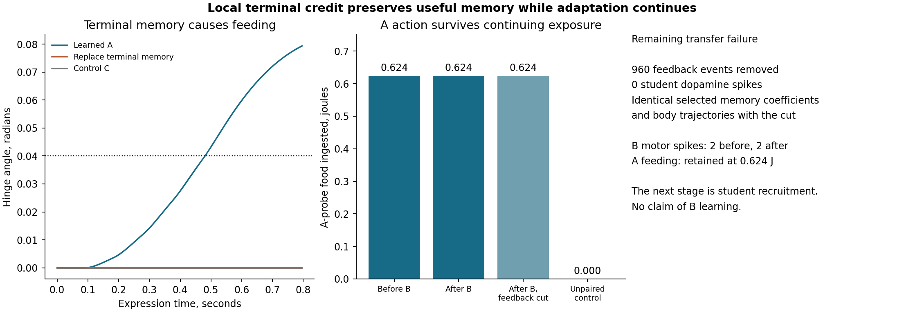
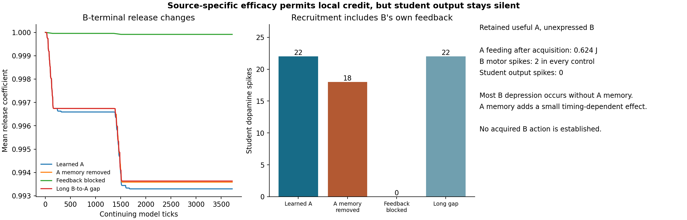
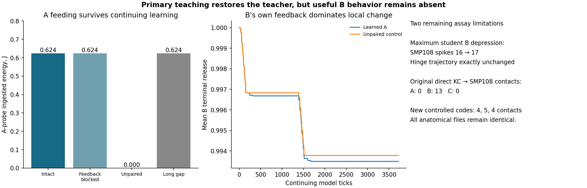
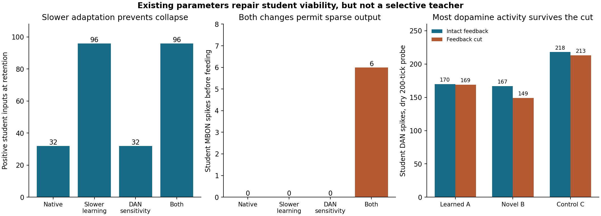
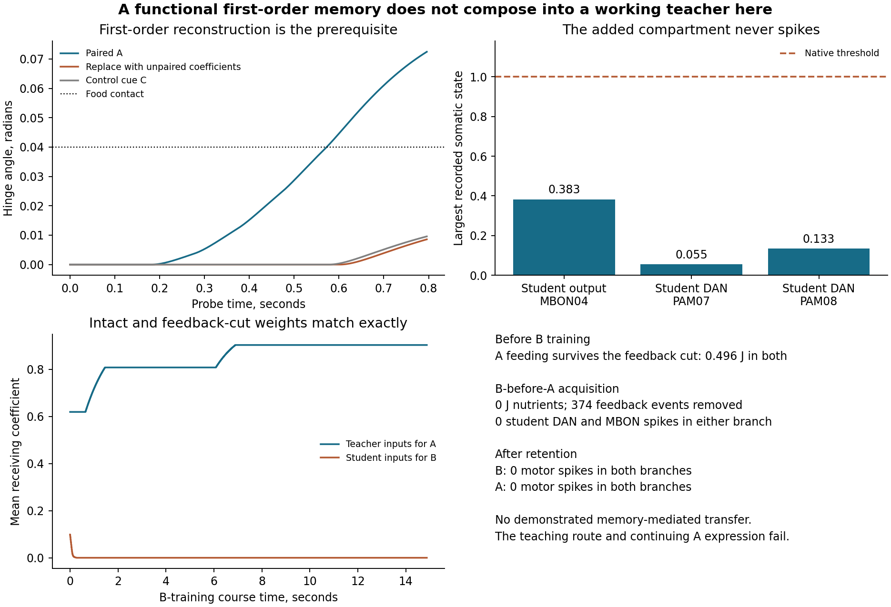
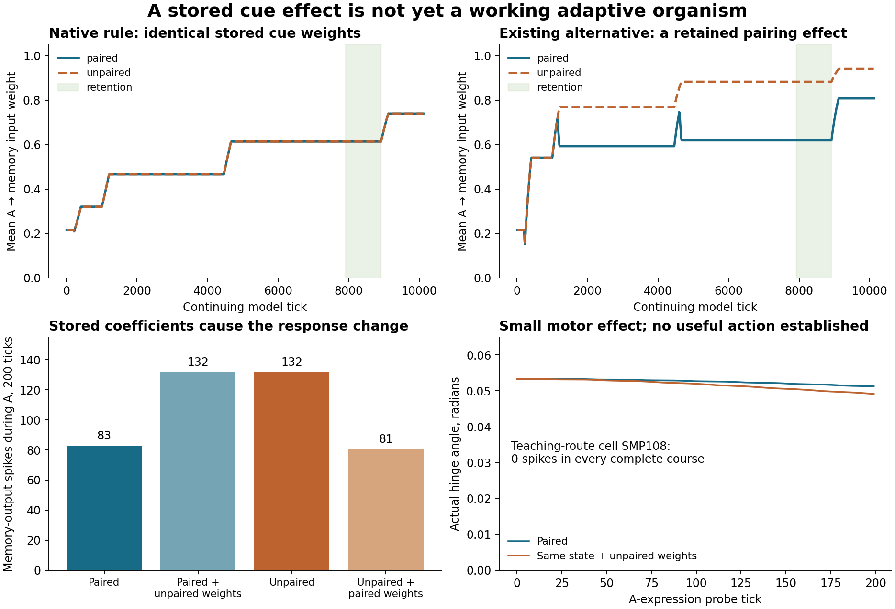
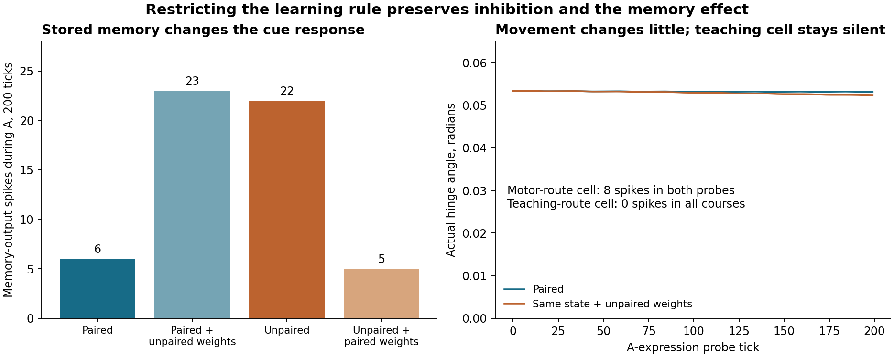

# Memory that can guide movement and teach another cue

This experiment asks whether an acquired PAULA memory can affect both behavior
and further learning while adaptation continues. The first requirement is an
A-to-nutrient memory that survives a delay and changes the response to A. Only
then should B-before-A, without nutrients, test memory-mediated teaching.
Second-order conditioning already exists in biology and computational models.
Success here would establish a composition in PAULA, not a new discovery about
flies or evidence of consciousness.

The files live in the existing active-inference repository. They do not change
the sensory preparation, its regulator experiments, or neuron-model defaults.

Research has resumed from the bounded negative transfer result. The latest
[terminal-credit preparation](#local-terminal-credit-and-continuing-memory)
stores a release-dependent direct memory and preserves useful A-guided feeding
through continuing unrewarded B-before-A exposure. A source-specific efficacy
hypothesis now permits a small teacher-dependent change at B terminals, but
acquired B action remains unestablished. Broader primary teaching resolves the
student-output inhibition of A's teacher pathway. The remaining checks address
unequal controlled cues and the physical readout's insensitivity to student
memory in the tested state.
The overall research objective remains active; completion of the earlier
bounded experiment was not completion of that objective.

The earlier bounded transfer experiment completed with a specific negative result.
The small preparation can express a retained A memory as feeding. In the
composed preparation, however, feedback events never recruit the student
dopamine cells, and B-before-A does not produce memory-mediated B behavior.
Cutting that feedback preserves the original A feeding response but changes
neither the selected learning trajectories nor subsequent movement. Continued
cue exposure also removes A-guided movement in both branches.

First-order learning and memory-dependent movement were already accepted
project capabilities. The [July research record](../../active_inference/RESEARCH_LOG.md#2026-07-30--paula-mushroom-body-counterconditioning-changes-embodied-food-approach-r-local-learned-avoidance)
and [earlier embodied experiment](../../active_inference/experiments/embodied_mb_food_avoidance_causal.py)
describe physical-contact teaching and learned food avoidance across four
seeds, with an output-specific intervention restoring collection while
preserving learned neural activity. The July raw artifact is absent locally;
this attribution relies on the accepted record and implementation, not a fresh
re-audit. Reconstructing first-order learning here is a prerequisite, not a new
scientific capability. The additional result is the tested failure to compose
it with the identified candidate teaching route under the declared boundaries.

## Local terminal credit and continuing memory



This line addresses the diagnosed learning-site and timing limitations with a
separate opt-in composition in `terminal_credit.py`. It does not change PAULA
defaults. The original selected receiving rule cannot update an inactive B
input when dopamine arrives later. Its rapid dopamine-independent update also
destroyed weak student inputs. Slower adaptation fixed that destruction but
did not supply delayed credit. The existing pre/post spike-trace extension
requires a postsynaptic spike, while the existing graded predictor requires
different receptor and release architecture. These limits motivate testing
local credit at KC output terminals.

[Hige et al., 2015](https://www.janelia.org/publication/heterosynaptic-plasticity-underlies-aversive-olfactory-learning-drosophila)
provides biological motivation for dopamine-paired KC-output depression. Its
gamma1pedc measurements also support induction without MBON spiking. This does
not establish the receptor kinetics, compartment localization or efficacy
parameters used here in alpha1 and gamma4.

The new class reuses the existing `eligibility_step` bounded-flow calculation,
with dopamine and KC history supplying its depressive factor. A local KC trace
tracks actual KC spikes, and a separate dopamine trace tracks actual arriving
signals at measured, compartment-matched DAN-to-KC inputs. Receptor weights
are proportional to birth contact counts and normalized to sum one within
each local group. The previous completed traces modify only the corresponding
KC-to-MBON terminal release coefficients. With release coefficient q, KC trace
x and dopamine trace d, the added update is q multiplied by exp(-0.1 d x).
The KC and dopamine traces have decay times of 64 and four model ticks. These
are declared engineering parameters, not inferred fly receptor measurements.

This is a new phenomenological composition of existing mathematical pieces.
It retains native receiving updates and native returning adaptation; emitted
events use the pre-update release coefficient. Other terminals do not receive
the new update. There is no stimulus identity, outcome value, training-phase
switch or behavioral target in the neuron rule. The traces are checkpointed
dynamical state. Focused tests verify delayed credit after the KC input ends,
little reverse-order effect in the tested timing, no added learning without
dopamine, unchanged unrelated terminals, native update/release order, and
continued state across a copy.

`terminal_anatomy.py` adds the measured dopamine providers to the selected KCs,
including the routes excluded by the previous direct-MBON selection. The cut
now has 276 neurons and 4,218 internal directed pairs representing 16,873
contacts. All 41 added cells are identified DAN providers; the 192 KCs and
controlled codes are unchanged. Another 9,383 cells retain boundary identities
and incident connections. There are 81 configured alpha1 KC receptor groups
and 93 gamma4 groups, affecting 255 output terminals. Fifteen alpha1 and three
gamma4 KCs have outputs without matching receptor paths in this cut. Those
outputs receive no invented dopamine input. Cell-pair anatomy does not locate
the individual contacts within axonal compartments, so terminal-group coupling
remains an explicit assumption.

`terminal_course.py` runs paired, unpaired and mechanism-disabled courses on
that same graph. All use native weak receiving and returning rates, 1e-8 and
1e-6, rather than the earlier selected receiving rule and its 0.01 rate. The
DAN-to-MBON modulation surrogate and global student-DAN sensitization are not
used. Primary nutrients still drive the identified PAM11 cells through the
experimental sensory boundary; dopamine reaches KC learning groups through
the actual neural connections. The earlier output sensitivity, muscle filter,
hinge, food-contact transducer and complete direct-training protocol remain.

After retention, paired A ingests 0.624 J, while the unpaired and disabled
controls ingest none. Its mean alpha1 A-terminal release is 0.384857, compared
with approximately one in the controls. `terminal_expression.py` substitutes
only selected KC terminal release coefficients, preserving receiving weights,
all other neural state, queues, body and organs. Replacing the paired release
coefficients with unpaired coefficients eliminates feeding. Transferring paired
coefficients into the unpaired state restores 0.624 J. The paired sham exactly
replays the original somatic and physical trajectories. C from that retained
state does not feed. Both receiving coefficients and release coefficients on
96 active connections continue changing during each A probe.

An independent dry A probe recruits eight SMP353 and eight SMP108 spikes
without food or PAM11 spikes. The existing B-before-A course then tests whether
that memory survives further exposure and teaches another cue. The paired,
projection-cut and first-order-unpaired branches run 3,720 additional ticks
without any nutrients, keeping all adaptation active. A-guided feeding remains
0.624 J afterward in both paired branches and remains absent in the unpaired
control. Mean A-terminal release changes only from 0.384857 to 0.384880 during
the continuing course. This preparation therefore removes the earlier loss of
useful A expression during that challenge. The comparison changes learning
locus, native receiving rule/rate and provider inclusion; it does not isolate
trace duration as the sole cause of that improvement.

B is still not acquired at the reference projection efficacy. Its dry response
has two motor spikes before and after the course, and its excursion stays below
the food-contact angle. Paired acquisition produces 960 forward projection
events, versus 576 after unpaired first-order nutrients. Nevertheless, student
dopamine cells and MBON04 remain silent. Removing all 960 events produces
exactly the same selected receiving coefficients, terminal coefficients and
body trajectories as the intact course. The small B-terminal change from
1.0 to 0.999915 is native adaptation, not evidence of dopamine-mediated transfer.

The [numerical evidence](evidence/terminal-credit.json) includes receptor/source
bindings, course and checkpoint hashes, terminal substitutions, continuing
traces and projection comparisons. The next unresolved step is now recruitment
by a retained teacher signal, rather than recovering A after extinction. Dry A
intact-minus-cut somatic records permit a diagnostic first-crossing estimate
with all other inputs held fixed. The smallest predicted projection gain is
60.1357, at PAM08 root `720575940605280201`. This is a linearization of the
recorded native dynamics before any dopamine cell spikes, not a validated
coupled-network response or a biological efficacy measurement. It defines one
prospective source-specific efficacy comparison at gain 64 in
`feedback_efficacy.py`; no synapse count or sign is altered by that hypothesis.

The 43 focused tests, including the subsequent efficacy and continuation
controls, pass. Its exact
checkpoint replay and executed causal branches supply the behavioral evidence.
First-order association itself remains an established project capability; the
new result here is the tested learning-site composition and retained action
through the previously destructive continuing exposure. Higher-order learning
and the overall research goal remain open.

```sh
uv run --no-sync python -m simulations.drosophila.memory_feedback.terminal_anatomy \
  .live/research/flywire783 \
  .live/research/flywire783/memory-alpha1-gamma4-cut-20260910 \
  .live/research/flywire783/memory-terminal-cut-20260910
uv run --no-sync --with cloudpickle==3.1.2 python \
  -m simulations.drosophila.memory_feedback.terminal_course \
  .live/research/flywire783/memory-terminal-cut-20260910 \
  .live/research/flywire783/memory-terminal-paired-20260910
# Repeat with --unpaired or --disabled and the matching distinct output.
uv run --no-sync --with cloudpickle==3.1.2 python \
  -m simulations.drosophila.memory_feedback.second_order \
  .live/research/flywire783/memory-terminal-paired-20260910 \
  .live/research/flywire783/memory-terminal-second-intact-20260910
# Repeat with --cut; use the unpaired receiver for its continuing control.
uv run --no-sync python -m simulations.drosophila.memory_feedback.terminal_analysis \
  .live/research/flywire783 simulations/drosophila/memory_feedback/evidence
```

## Feedback recruitment and teacher-dependent local credit



`feedback_efficacy.py` tests the prospective gain of 64 on the 24 measured
SMP108-to-PAM07/PAM08 receiving inputs from birth. All other efficacies and
thresholds retain their reference settings. This is an engineering hypothesis
about efficacy, not a correction to contact counts. The paired direct course
still ingests 0.624 J during retained A, versus zero after unpaired nutrients.
One student dopamine spike now occurs during the food-available A probe.
Continuing acquisition starts from the earlier pre-food retention checkpoint,
so that diagnostic food and dopamine cannot teach B beforehand.

The nutrient-free B-before-A course recruits 22 student dopamine spikes, all
PAM08. Eighteen occur during B and the following short gaps, while four occur
during learned A. The first-order unpaired control still recruits the same 18
B/gap spikes. Thus most student recruitment is already possible without an A
memory. Blocking the measured projection during acquisition removes all 960
forward events and all 22 dopamine spikes. Adaptation continues in every case.

The mean retained gamma4 B-terminal release coefficient is 0.993298 with
learned A, 0.993587 after unpaired first-order nutrients, and 0.999915 with the
projection blocked. `teacher_substitution.py` supplies a tighter memory control.
It replaces only alpha1 A-terminal release with matched unpaired values before
continuing acquisition. The rest of the paired neural runtime, including its
queues, traces, receiving weights and RNG, and the physical state stay intact.
Reversing those declared terminal edits in loaded diagnostic objects restores
byte-identical serialized runtime. That control removes the four A-period
dopamine spikes and yields exactly the unpaired mean B release, 0.993587.
The A-memory-dependent extra depression is therefore 0.000289 on the mean
release coefficient in this preparation.

A temporal control places 1,000 blank ticks between B and A instead of 20,
while preserving total exposure and elapsed time. It retains the four A-period
dopamine spikes but leaves B release at 0.993633. This supports dependence on
temporal proximity, rather than interpreting any dopamine spike as successful
credit. The traces establish a small retained terminal effect caused by A
memory through neural feedback. Most B-terminal depression remains present
without that memory.

There is still no acquired B action. All five controls produce two motor spikes
and 17 SMP108 spikes during independent retained B probes. Both MBON04 cells
remain silent. Intact and projection-cut B body trajectories are exactly equal,
although their student membrane potentials differ by up to 0.004431. A-guided
feeding remains 0.624 J after intact, cut and temporally displaced acquisition;
removing A memory eliminates its feeding as expected. The stored local effect
must not be reported as completed second-order behavioral learning.

The retained graph contains inhibitory MBON04-to-SMP108 pairs of 41 and 19
contacts. Neither MBON04 directly contacts the hinge-driving SMP353 cell in
this cut. The current readout problem therefore includes both silent student
outputs and their indirect route to the physical action. The next bounded
test in `student_output.py` halves both MBON04 thresholds from birth, retaining
their ratio and all measured connections. An independent novel-B trace reaches
0.522561 against a native threshold of one, giving a first-crossing ratio of
1.913650. Two is the next power of two. This tests an explicitly assumed
operating point and its recurrent consequences, not known fly excitability.

[The numerical audit](evidence/feedback-efficacy.json) hashes course and
continuation artifacts, verifies the terminal-only teacher intervention,
compares timing and projection controls, and reports the silent output stage.
The old `second_order.py` runner saved ambient RNG at its final checkpoint
instead of the active branch RNG. Its fixed one-tick travel delays make that
distinction behaviorally inert here, but those final checkpoints do not retain
the advancing random stream. The new `continuing_course.py` wrapper fixes that
for subsequent courses without changing source files pinned by older records.
The teacher control uses the corrected wrapper. Its earlier run without
`-rng` in the directory name is superseded and excluded from the audit.

```sh
uv run --no-sync --with cloudpickle==3.1.2 python \
  -m simulations.drosophila.memory_feedback.feedback_efficacy \
  .live/research/flywire783/memory-terminal-cut-20260910 \
  .live/research/flywire783/memory-efficacy-paired-20260910
# Repeat with --unpaired and a distinct output.
uv run --no-sync --with cloudpickle==3.1.2 python \
  -m simulations.drosophila.memory_feedback.continuing_course \
  .live/research/flywire783/memory-efficacy-paired-20260910 \
  .live/research/flywire783/memory-efficacy-second-intact-new
# Repeat with --cut, --displaced, and the unpaired receiver in distinct outputs.
uv run --no-sync --with cloudpickle==3.1.2 python \
  -m simulations.drosophila.memory_feedback.teacher_substitution \
  .live/research/flywire783/memory-efficacy-paired-20260910 \
  .live/research/flywire783/memory-efficacy-unpaired-20260910 \
  .live/research/flywire783/memory-efficacy-teacher-removed-rng-20260910
uv run --no-sync --with cloudpickle==3.1.2 python \
  -m simulations.drosophila.memory_feedback.efficacy_analysis \
  .live/research/flywire783 simulations/drosophila/memory_feedback/evidence
```

## Active student output suppresses the teacher

The threshold comparison in `student_output.py` is complete. Halving both
MBON04 thresholds makes the student outputs spike while preserving paired
A feeding at 0.608 J before and after continuing acquisition. Unpaired A still
ingests nothing. However, every A presentation during B-before-A now produces
11 MBON04 spikes and only one SMP108 spike, with no student dopamine spikes.
The gamma4 A terminals remain near their initial release, 1.000096 after direct
training, while alpha1 A release falls to 0.384857. The primary nutrient boundary
has trained A in alpha1 but left its gamma4 inhibitory output untrained.

This is a causal conflict, not just simultaneous activity. In independent dry A
probes, `output_inhibition_probe.py` blocks only the two measured MBON04-to-SMP108
projections. Removing 11 forward arrivals restores SMP108 from one spike to
eight and student dopamine from zero spikes to two. MBON04 still produces 11
spikes and SMP353 still produces eight. The same intervention in the unpaired
parent leaves SMP108 and student dopamine silent. It therefore releases the
existing learned teacher response rather than creating one without A memory.

During acquisition, B itself still recruits student dopamine. Its complete
gamma4 terminal-release trajectory is exactly equal between paired and
first-order-unpaired courses, ending at a mean of 0.993781. Projection-blocked
acquisition ends at 1.000068. Independent retained B probes produce two motor,
16 SMP108 and three MBON04 spikes in every condition. Intact and projection-cut
body trajectories are exactly equal. Making student output active removed the
small A-dependent local-credit effect of the previous preparation without
producing acquired B action. All these continuations use the corrected branch
RNG checkpoint wrapper. [The stored audit](evidence/student-output.json)
contains the causal probe hashes, coefficient comparisons and course records.

The next comparison in `primary_boundary.py` broadens primary teaching to the
represented PAM11, PAM07 and PAM08 cells. It uses the same actual ingested-energy
signal and current per dose, regardless of cue or phase. The boundary is zero
whenever no nutrients enter the body, including all B-before-A acquisition.
[Yamada et al., Figure 5](https://pmc.ncbi.nlm.nih.gov/articles/PMC9937650/)
used PAM-cluster stimulation during first-order pairing before measuring
potentiated SMP108 responses. That experiment motivates comparing broader
recruitment here. The chosen cell-type coverage and equal currents are explicit
engineering assumptions, not a reconstruction of the genetic driver or natural
sugar sensory wiring. This comparison tests whether first-order learning can
remove A's opposing student output while leaving B eligible for later neural
teaching. The completed result and subsequent cue comparison are below.

```sh
uv run --no-sync --with cloudpickle==3.1.2 python \
  -m simulations.drosophila.memory_feedback.student_output_analysis \
  .live/research/flywire783 simulations/drosophila/memory_feedback/evidence
uv run --no-sync --with cloudpickle==3.1.2 python \
  -m simulations.drosophila.memory_feedback.primary_boundary \
  .live/research/flywire783/memory-terminal-cut-20260910 \
  .live/research/flywire783/memory-primary-paired-20260910
# Repeat with --unpaired and its distinct output.
# Continue a completed parent with the same primary-boundary module and
# --continue-course, adding --cut or --displaced for the causal controls.
```

## Broader primary teaching and remaining assay limits



Broader primary recruitment depresses A's gamma4 terminal release to a mean of
0.293697 while alpha1 A release reaches 0.384857. During nutrient-free
B-before-A, learned A again recruits eight SMP108 spikes and two student
dopamine spikes per presentation. The opposing untrained student output no
longer blocks the teacher. A-guided feeding remains 0.624 J after intact,
projection-cut and temporally displaced acquisition, versus zero in the
first-order-unpaired control. The primary teaching boundary stays zero
throughout all 3,720 acquisition ticks.

The retained gamma4 B release is 0.993492 in the paired course, 1.000068 with
feedback blocked, and 0.993781 after unpaired first-order nutrients. The extra
mean depression associated with paired A is 0.000289. Extending the B-to-A gap
to 1,000 ticks leaves a smaller effect despite retaining the A-period dopamine
spikes. These changes do not establish acquired B action. B produces two
SMP353, 16 SMP108 and three MBON04 spikes in every independent retained probe.
Intact and projection-cut B body trajectories are exactly equal.

`student_expression.py` provides a terminal-only expression control. It
replaces only the intact course's gamma4 B coefficients with values from the
projection-cut checkpoint. Its sham exactly reproduces the recorded neural
and body trajectories. Receiving weights and all other terminal coefficients
remain unchanged by the intervention. The substitution shifts one MBON04 spike
in time, yielding two differing spike bins, but leaves SMP108 spikes and the
body trajectory identical. Thus the stored coefficients affect student neural
expression while failing to change the current action.

A separate diagnostic on the earlier active-student parent sets all 32 gamma4
B terminal coefficients to zero. This is the maximum allowed terminal
depression, imposed for diagnosis rather than acquired by learning. It removes
all three MBON04 spikes and increases SMP108 from 16 to 17 spikes, yet the hinge
trajectory remains exactly unchanged. This result applies to that retained
state and the 200-tick dry probe, not every possible future state. It identifies
a physical-readout limitation that simply increasing learning strength may not
resolve. The current hinge is driven by SMP353; the student output directly
inhibits SMP108 and has no direct retained connection to SMP353.

The anatomical audit also identifies a controlled-cue confound. B alone
activates eight gamma KCs with 13 direct contacts to SMP108; A and C activate
none. B's alpha/beta KCs were selected after the stronger A/C pool. These
asymmetries can create unequal innate feedback before memory transfer.
`balanced_codes.py` reassigns the same 192 KCs into disjoint A/B/C codes with 32
alpha/beta and 32 gamma cells each. It greedily balances normalized measured
contact loads to each retained MBON07, MBON04, SMP108 and APL, with equal
cardinality per KC type. It uses no simulated response or behavioral outcome.
This remains an engineered cue panel and still requires reciprocal cue-label
controls before generalization.

The new codes have 4, 5 and 4 direct contacts to SMP108. Their total contacts
to MBON07 are 661, 664 and 661, and to MBON04 are 166, 165 and 157. Balance is
approximate and limited to the declared targets. The complete `nodes.json`
and `edges.npz` files are byte-identical to the previous cut, so neither
internal nor boundary anatomy changed. Paired and unpaired direct courses on
this panel preserve the A feeding contrast, 0.624 J versus zero. The completed
nutrient-free transfer controls are reported below.

[The numerical audit](evidence/primary-boundary.json) includes complete source
and artifact hashes, the terminal substitutions, the imposed-depression probe,
the original cue-specific routes and the prospective reassignment specification.

```sh
uv run --no-sync --with cloudpickle==3.1.2 python \
  -m simulations.drosophila.memory_feedback.primary_analysis \
  .live/research/flywire783 simulations/drosophila/memory_feedback/evidence
uv run --no-sync --with cloudpickle==3.1.2 python \
  -m simulations.drosophila.memory_feedback.balanced_codes \
  .live/research/flywire783/memory-terminal-cut-20260910 \
  .live/research/flywire783/memory-balanced-codes-20260910
uv run --no-sync --with cloudpickle==3.1.2 python \
  -m simulations.drosophila.memory_feedback.primary_boundary \
  .live/research/flywire783/memory-balanced-codes-20260910 \
  .live/research/flywire783/memory-balanced-paired-20260910
# Repeat with --unpaired and its distinct output, then use --continue-course.
```

## Cue balance separates teacher feedback from B's own activity

The reassigned cue panel removes B's autonomous feedback in this preparation.
The intact B-before-A course recruits four student dopamine spikes, all during
learned A. Neither the first-order-unpaired nor projection-cut course recruits
any student dopamine. Feedback blocking removes 384 forward events. A feeding
remains 0.624 J afterward in both paired branches. These comparisons use the
same retained circuit, active adaptation and nutrient-free acquisition as before.

| Acquisition condition | Student dopamine spikes | Retained mean gamma4 B release | Retained B motor spikes |
| --- | ---: | ---: | ---: |
| Learned A, intact feedback | 4 | 0.999856760082 | 0 |
| Feedback blocked | 0 | 1.000033617020 | 0 |
| First-order unpaired | 0 | 1.000033617020 | 0 |
| Long B-to-A gap | 4 | 1.000033617000 | 0 |

The long-gap control retains teacher dopamine activity but almost eliminates
its effect on B terminals. The paired course's extra B depression is now
separable from the autonomous B feedback that dominated the earlier cue panel.
It still has not produced useful B action. Retained B recruits eight MBON04
spikes and no SMP108 or SMP353 spikes in all four conditions. Intact and
projection-cut B body trajectories are exactly equal.

Repeating the imposed-depression diagnostic on this panel removes all eight
MBON04 spikes, but SMP108 remains silent and the body trajectory remains
unchanged. This exposes an additional expression constraint: the current
preparation supplies equal cue-presence excitation to SMP353 alone. The student
output inhibits SMP108, which receives no corresponding experimental input.
That boundary needs a separate causal check; larger memory coefficients alone
cannot be assumed to produce action in the tested state. Biological evidence
for SMP108 odor responses and its lateral-horn inputs is described in
[Yamada et al., Figure 5](https://elifesciences.org/articles/79042/figures), but
any input approximation here must remain an explicit engineering boundary.

The intact course also measures the timing mismatch directly. In the first A
presentation, SMP353 spikes first at A tick 22, SMP108 at tick 25, and student
dopamine at ticks 76 and 148. With the preceding 20-tick gap and the travel/trace
updates, the later dopamine event can affect a B terminal roughly 171 ticks
after the last driven B tick. A completed trace with decay time 64 retains
about 6.9% of its value over that interval.

`eligibility_window.py` tests a decay time of 256 from birth, the next power of
two above 171/log(2). That retains just over half of a completed trace across
the interval. The normalized EMA also builds more slowly, so this is a full
timing comparison rather than a guarantee of stronger direct learning. The
174 configured cells change only that parameter at birth. Restoring their
original decay time in diagnostic copies produces byte-identical serialized
neural and RNG state. The paired direct course retains A feeding at 0.440 J,
versus zero for unpaired nutrients. Nutrient-free transfer controls with this
longer trace are now running.

[The balanced-code audit](evidence/balanced-codes.json) records the four
continuations, the repeated expression diagnostic, teacher event times, the
isolated birth-parameter check and both completed longer-trace direct courses.

```sh
uv run --no-sync --with cloudpickle==3.1.2 python \
  -m simulations.drosophila.memory_feedback.balanced_analysis \
  .live/research/flywire783 simulations/drosophila/memory_feedback/evidence
uv run --no-sync --with cloudpickle==3.1.2 python \
  -m simulations.drosophila.memory_feedback.eligibility_window \
  .live/research/flywire783/memory-balanced-codes-20260910 \
  .live/research/flywire783/memory-window-paired-20260910
# Repeat with --unpaired, then continue each parent through primary_boundary
# with --continue-course and the matched projection/timing controls.
```

## Student viability and the next mechanism decision



`student_viability.py` compares the prior course with three new courses using
existing parameters, all assigned at birth and unchanged across phases. One
slows MBON04 receiving adaptation from 0.01 to 1e-5. A conservative initialization
calculation chooses that rate so 140 worst-case unit arrivals cannot consume
more than 10% of the weakest 0.06 birth input under the unmodulated negative
update. The next lower power of ten is used. This calculation is not a bound
under every future recurrent or modulated state. A second condition applies
the existing output sensitivity factor of 32 to student dopamine-cell
thresholds. The third combines them. It is a two-factor mechanism comparison,
not a behavior-optimized parameter search. Anatomy, cue codes, equations and
external currents are identical across the four courses.

The [hashed evidence](evidence/student-viability.json) separates measurements
before the food well becomes available from later feeding. Of the 96 student
memory inputs, only 32 unexposed B inputs remain positive in the reference and
sensitivity-only courses. Slower receiving adaptation preserves all 96, with
minimum retained weights 0.057840 in the slow-only course and 0.058265 in the
combined course. All receiving and returning adaptation stays enabled; the
slower receiving rate applies to all MBON04 inputs, not only its selected
memory inputs.

Sensitivity alone recruits 1,184 student dopamine spikes before feeding, but
MBON04 remains silent and its previously exposed inputs still collapse. Slower
adaptation alone preserves the inputs but recruits no student dopamine or
MBON04 spikes. The combination permits 1,181 student dopamine spikes and six
MBON04 spikes before feeding, followed by two MBON04 spikes during retained A.
All three modified courses retain 0.496 J ingestion during the A feeding probe.
These are improvements in the viability of the composed cells, not evidence
of a new association or delayed teaching.

`viability_probe.py` then branches from the pre-feeding retention checkpoint
for independent dry A, B and C probes, with and without the measured feedback
projection. There is no pump or food well. In the combined condition, A evokes
170 student dopamine spikes with feedback and 169 with it cut. Novel B evokes
167 and 149; C evokes 218 and 213. The cut removes 55, 275 and 44 forward events
respectively. Thus most recruited dopamine activity survives removal of the
candidate teaching projection. Increasing all dopamine cells' sensitivity
does not create a selective A-memory teacher. Novel B also evokes eight motor
spikes before any second-order training, so that movement cannot be counted as
a learned B response. Student MBON04 still emits no spikes during B or C.

The existing selected learning equation has a separate timing limitation.
It enumerates only input ports with a positive arrival in the current tick.
After a B input stops, a later local dopamine state cannot update that input
without another B arrival. The new focused test verifies this with positive
receiving and returning rates and a nonzero later dopamine state. This is a
limitation of the selected rule, not of every PAULA extension. The available
`EligibilityTraceNeuron` adds pre/post spike timing traces, while
`PredictiveReceptorNeuron` has contextual and signed-error traces but requires
graded release and two opponent zero-throughput error receptors. Neither is
an unchanged drop-in replacement for the present spiking MBON/DAN circuit.

The earlier mushroom-body code already documents the destructive effect of
unreinforced Hebbian updates and an explicit tonic plasticity gate. That
baseline remains relevant. Its fully shut gate is not adopted here as a
substitute for the requested continuing ordinary adaptation. Slower positive
adaptation is enough to remove the current student's early input collapse,
but supplies neither delayed credit nor a selective teaching signal.

A read-only boundary audit changes the next architectural decision. The
current student selection includes 27 PAM07/PAM08 cells chosen for direct
MBON04 afferents. Counting providers to the 96 selected gamma KCs as well
identifies 63 cells. The included cells carry 277 of 539 measured provider-to-KC
contacts, and receive 30 of 66 SMP108 contacts onto that provider set. Thirteen
excluded providers have both SMP108 input and output onto the selected gamma
KCs. Their identities and counts are retained in the evidence. This does not
prove all excluded cells belong in the executable cut. It shows that a
selection based on the DAN-to-MBON surrogate does not cover the measured
DAN-to-KC routes that matter to a presynaptic learning-site hypothesis.

[Hige et al., 2015](https://pmc.ncbi.nlm.nih.gov/articles/PMC4674068/) found
dopamine-paired depression of KC-to-MBON transmission even when MBON spikes
were suppressed, in the aversive gamma1pedc compartment. That result motivates
examining heterosynaptic learning at KC outputs; it does not specify gamma4
receptor kinetics or validate this model. The next bounded line should examine
the actual DAN-to-KC routes and the local state needed for delayed teaching,
with a comparison against the current rule. Any new receptor/eligibility
composition must remain opt-in, retain ordinary adaptation and reciprocal
signaling, and demonstrate its timing and memory-specific causal effects
before being credited with functional transfer. A global dopamine sensitivity
increase has now been tested and is insufficient for that purpose.

The 35 focused tests pass, including the arrival-only credit limitation.
No default neuron dynamics, sensory-study files or manuscript files changed.
The earlier stopping point below belongs to the previous bounded experiment;
it does not stop the continuing research goal.

```sh
uv run --no-sync --with cloudpickle==3.1.2 python \
  -m simulations.drosophila.memory_feedback.student_viability \
  .live/research/flywire783/memory-alpha1-gamma4-cut-20260910 \
  .live/research/flywire783/memory-viability-combined-20260910 --slow --sensitive
# Use only --slow or only --sensitive with the matching distinct output name.
uv run --no-sync --with cloudpickle==3.1.2 python \
  -m simulations.drosophila.memory_feedback.viability_probe \
  .live/research/flywire783/memory-viability-combined-20260910 \
  .live/research/flywire783/memory-viability-probe-combined-20260910
# Repeat for the sensitivity-only receiver and probe output.
uv run --no-sync python -m simulations.drosophila.memory_feedback.viability_analysis \
  .live/research/flywire783 simulations/drosophila/memory_feedback/evidence
```

## Earlier completed transfer test and stopping point



The [numerical evidence](evidence/bounded-transfer.json) contains source and
artifact hashes, full phase summaries, coefficient measurements, and exact
intact-versus-cut comparisons. Raw records remain in the existing ignored
`.live/research/flywire783/` directory. The stages below retain the earlier
negative results as part of the bounded comparison, rather than presenting
every intermediate failure as the current outcome.

### First-order feeding prerequisite

`feeding.py` keeps the 77-cell cut and existing PAULA equations. Equal
cue-presence input to SMP353 replaces the earlier continuous tonic input.
This is an explicit experimental approximation to the omitted odor-related
inputs, not reconstructed lateral-horn activity. SMP353 and SMP108 use existing
threshold parameters divided by 32. That factor is the next power of two above
the single-event transmission requirement for the measured 48-contact
SMP353-to-SMP108 connection. It was calculated before behavioral execution,
not fitted to feeding outcomes. Other cells retain their declared parameters.

The body is one passive MuJoCo hinge driven by filtered SMP353 spikes through
a fixed gain of four. Food enters the gut only when the existing physical
angle reaches a fixed 0.04-radian well. The transducer has no cue identity or
action target. Pump conditioning precedes the contact-dependent test. One
model tick advances the body by 0.004 seconds; that mapping is engineering and
does not calibrate PAULA to fly learning times.

After two direct pairings and 1,000 blank retention ticks, A reaches food and
ingests 0.440 J. From the same retained state, replacing selected KC-to-MBON
receiving and corresponding release coefficients with those from unpaired
training prevents contact and ingestion. Transferring paired coefficients to
the unpaired preparation restores 0.440 J ingestion. C from the paired retained
state does not reach food. All 64 active selected receiving coefficients
continue changing during these probes. The A sham replays the full original
somatic and physical trajectory exactly.

A dry A probe recruits seven SMP353 and seven SMP108 spikes with no food or
PAM11 spikes. Thus an acquired cue response can reach the candidate teaching
interneuron without a concurrent primary outcome. This does not establish
successful teaching downstream. The later sequential feeding probes are also
not clean discrimination tests: eating changes organs, dopamine and memory,
and residual physical contact can continue across cue boundaries. The fresh
checkpoint branches above separate those effects.

### Student composition fails before transfer

`student_anatomy.py` adds the measured gamma4 candidate compartment, reaching
235 cells. It includes two MBON04 cells with measured input to SMP108, their
27 PAM07/PAM08 providers, 96 ranked gamma KCs, their APL cells, and 32 new
alpha/beta KCs for B. A and C retain their original alpha/beta codes; each cue
also has a disjoint gamma code. This is a controlled rank-based sample, not
natural odor selectivity. Both sides are included where measured connections
cross. All 3,362 internal directed pairs, representing 15,416 contacts, execute;
9,078 outside cells retain boundary identities and incident pairs. All counts
come from the pinned FlyWire materialization, not the separate hemibrain
specimen used in the motivating biological studies.

The first unbounded student run stopped at tick 219. Three weak positive KC
inputs had crossed zero under the selected additive rule. The bounded
comparison applies PAULA's existing zero lower-bound semantics only to those
selected excitatory memory ports. A cell-wide zero bound would destroy
inhibitory inputs. `nonnegative_rule.py` preserves their native signed learning
and permits zeroed memory ports to recover under a later positive update.
No eligibility dynamics, positive weight floor or reward-dependent reset was
added. Partial unbounded records are excluded from completed-course results.

The two completed bounded courses show a nonfunctional student compartment.
Across all 10,120 ticks, MBON04, PAM07 and PAM08 emit no spikes. Their largest
recorded somatic states are 0.383, 0.055 and 0.133, below native threshold 1.
All 64 previously exposed gamma A/C memory inputs are zero by retention.
Native student inputs and the selected rule therefore fail to maintain an
active student output under these boundaries.

Composition also weakens first-order discrimination. Retained paired A ingests
0.496 J and unpaired A ingests 0.272 J. The latter must not be described as a
memory-free preparation or a successful paired-only feeding criterion.

### B-before-A and projection interruption

`second_order.py` resumes each direct-training retention checkpoint before
any feeding probe. Two trials present B for 140 ticks, a 20-tick blank, A for
200 ticks, and 1,000 recovery ticks. Another 1,000 blank ticks precede expression.
No nutrients or food well are available anywhere in this acquisition course.
The environment supplies controlled cue currents and equal cue-presence input;
it gives no B reward, association, target action or student-DAN current. All
ordinary adaptation remains enabled, with minimum positive receiving and
returning rates of 1e-8 and 1e-6 respectively.

Four branches test intact feedback, interrupted feedback, a temporal control
with a 1,000-tick B-to-A gap and matched total exposure and duration, and intact
feedback after unpaired first-order training. The last directory has the
historical shorthand `no-A-memory`; its actual condition is unpaired nutrients,
not an assertion that no cue memory exists.

The interruption removes only arriving forward events on the 11 measured
SMP108-to-PAM07/PAM08 pairs. It preserves all anatomical connections, reciprocal
events, intrinsic adaptation and motor readout. Before B training, the same
intervention removes 77 events during an A feeding probe while preserving
0.496 J ingestion, all teacher/motor somatic states, the physical trajectory
and selected receiving coefficients exactly. Its intact sham also reproduces
the original recorded A probe exactly. This validates the separation between
the candidate teaching projection and original A expression.

During B acquisition the cut removes 374 events. Student dopamine cells and
MBON04 remain silent with or without it. Student modulation stays exactly zero.
The intact and cut selected receiving weights, release coefficients and physical
trajectories match exactly throughout acquisition and retention. Small student
subthreshold differences establish that the projection has neural effects;
they never become a teaching signal in this preparation.

All 32 gamma B receiving coefficients fall from mean 0.09875 to zero in every
condition. They are all zero after 68 ticks of the first B presentation,
before the first A starts at tick 160. That loss also occurs with displaced B/A timing and unpaired
first-order nutrients, and is unchanged by interrupting feedback. It is an
exposure-driven consequence of the selected rule in silent cells, not evidence
that A memory teaches B. B subsequently produces zero SMP353 motor spikes in
every branch, despite 16 SMP108 spikes. An active interneuron alone is not a
successful teaching or movement result.

A expression also fails after this continuing unrewarded course. A produces
zero motor spikes and no feeding in both intact and cut branches. Its selected
receiving coefficients change from mean 0.618937 to 0.902938. The A-expression
traces match exactly between those branches, so the interruption did not cause
the loss. This documents a storage-state change and loss of expression; it does
not prove complete memory erasure or motor paralysis. No coefficient rescue
after B was used to separate every possible source of that later loss.

The failure is localized enough to stop this composition test: forward feedback
does not recruit student dopamine, the student input rule suppresses its weak
inputs without a teaching signal, and ongoing cue exposure does not preserve
useful A expression. The tested intervention preserves original A feeding but
has no effect on transfer because there is no effective downstream teacher.
This is not evidence against second-order conditioning in flies or a general
impossibility result for PAULA. It is one deterministic, engineered preparation
and a bounded set of causal branches. No further threshold search, expanded
circuit or new learning equation is justified by this result alone.

The 34 focused anatomical, physical, checkpoint-continuation, selected-rule and
projection-intervention tests pass. They verify implementation contracts; the
recorded courses and counterfactual trajectories support the scientific
statements. Observed process memory during concurrent transfer runs was about
241-279 MiB per Python process, with disk-backed course arrays. This is an
operating observation, not a controlled performance benchmark.

```sh
uv run --no-sync --with cloudpickle==3.1.2 python \
  -m simulations.drosophila.memory_feedback.feeding \
  .live/research/flywire783/memory-alpha1-cut-20260910 \
  .live/research/flywire783/memory-feeding-paired-20260910
# Repeat with --unpaired and a distinct output for its matched control.
uv run --no-sync python -m simulations.drosophila.memory_feedback.student_anatomy \
  .live/research/flywire783 \
  .live/research/flywire783/memory-alpha1-cut-20260910 \
  .live/research/flywire783/memory-alpha1-gamma4-cut-20260910
uv run --no-sync --with cloudpickle==3.1.2 python \
  -m simulations.drosophila.memory_feedback.student_course \
  .live/research/flywire783/memory-alpha1-gamma4-cut-20260910 \
  .live/research/flywire783/memory-student-paired-bounded-20260910
# Repeat with --unpaired and the student-unpaired-bounded output.
uv run --no-sync --with cloudpickle==3.1.2 python \
  -m simulations.drosophila.memory_feedback.second_order \
  .live/research/flywire783/memory-student-paired-bounded-20260910 \
  .live/research/flywire783/memory-second-intact-20260910
# Use --cut for the projection intervention, --displaced for the temporal control.
# Use the student-unpaired-bounded receiver for the first-order control.
uv run --no-sync --with cloudpickle==3.1.2 python \
  -m simulations.drosophila.memory_feedback.gate_expression \
  .live/research/flywire783/memory-student-paired-bounded-20260910 \
  .live/research/flywire783/memory-gate-expression-20260910
uv run --no-sync --with cloudpickle==3.1.2 python \
  -m simulations.drosophila.memory_feedback.transfer_analysis \
  .live/research/flywire783 simulations/drosophila/memory_feedback/evidence
```

## Biological choice and limits

[Yamada et al., 2023](https://elifesciences.org/articles/79042) identifies a route
from the alpha1 memory output through SMP353/354 and SMP108 to dopamine cells in
other compartments. Its behavioral and dopamine measurements motivate the
feedback hypothesis. [Aso et al., 2023](https://elifesciences.org/articles/85756)
links alpha1 output to movement through UpWind Neurons, including SMP353/354.
These studies use hemibrain anatomy and separate experimental animals. Our
reference below uses FlyWire 783. Type correspondences do not make their cells
the same specimen.

The reference contains both left MBON07 cells, all eight left PAM11 cells, left
SMP353, SMP108, APL, and 64 identified alpha/beta KCs. KCs are ranked by their
summed measured connections to the two MBON07 cells, before simulation. Alternate
ranks form two disjoint controlled input codes. This samples strong afferents;
it does not reproduce natural odor tuning or the full mushroom body. Every
directed pair among the 77 selected cells is retained, including reciprocal
MBON, DAN and KC connections. There are 1,045 internal pairs representing 6,140
synapses. Another 5,958 boundary cells retain their identities and incident
connections. Outside neurons do not run, and their input ports remain undriven.
No exact SMP354 type appears in the pinned annotation table; no cell is silently
substituted. Student-compartment targets of SMP108 remain a recorded boundary
until the alpha1 prerequisite is usable.

[Springer and Nawrot, 2024](https://pmc.ncbi.nlm.nih.gov/articles/PMC10806035/)
compares simplified rate-network motifs using selected plasticity and optimized
parameters. That is useful precedent, not evidence for this PAULA preparation.
[Rachad et al., 2025](https://doi.org/10.1016/j.celrep.2025.115593) studies aversive
higher-order conditioning. The abstract and publication metadata were accessible;
publisher full text was not. Its mechanism has not been adopted from the abstract.

[Ichinose et al., 2015](https://pmc.ncbi.nlm.nih.gov/articles/PMC4643015/) provides
another constraint on the reciprocal alpha1 circuit. Its manipulations support
reward augmentation through MBON-alpha1 feedback and NMDA-receptor signaling in
PAM-alpha1. The imported source assigns negative fast currents to all selected
MBON07-to-PAM11 pairs. That uniform sign is therefore not a sufficient account
of the proposed biological excitatory feedback. This experiment preserves the
imported reference and does not claim to reproduce that consolidation mechanism.

## First bounded comparison

The native fly builder gives all transmitting modulation vectors and receiving
modulator sensitivities zero. It therefore has no dopamine teaching channel.
The isolated experiment assigns existing M[1] transmission to the measured
PAM11-to-MBON07 pairs. Release starts at one and receiving sensitivity at the
original count-to-current magnitude, count times 0.02. This is an explicit,
unfitted transmitter/receptor assignment. Signed fast currents remain intact.
Both receiving and returning adaptation stay positive in every phase.

The first course uses PAULA's native multiplicative learning rule. MBON receiving
learning uses the existing NeuronParameters default, 0.01, while other parameters
retain the fly builder's settings. This tests learning at a usable rate without
claiming that the sensory execution defaults already learn memory. Six-block
expansion is available, but the first decision uses two blocks.

The bounded alternative uses the already implemented reward_hebb equation with
kappa=-10 and rh_decay=1 at MBONs. Dopamine suppresses its positive coincidence
term while active-input decay continues. This tests whether the existing rule
can express the depression needed for alpha1 disinhibition. It adds no equation.
The parameters are a declared engineering hypothesis, not a dopamine receptor
fit. The native rate-boost extension alone only changes update magnitude and
does not by itself supply this depression sign. Spike eligibility extensions
likewise do not identify a dopamine-dependent depression rule. They are not
automatically composed into this test.

Pairing is compared with the same nutrient quantity displaced into a gap.
The completed comparison uses 1,000 cue-free ticks on either side of the displaced
nutrient pulse. A short first execution used a pulse immediately before C and
exposed a backward-pairing confound from lingering modulation. Those four pilot
directories are retained locally but are not the completed comparison below.
The longer gap reduces modulation substantially, without pretending that an
exponential tail becomes exactly zero.
Naive cue responses, acquisition, 1,000 ticks of retention, and later A/C responses
occur in the same continuing neural preparation and physical body. A and C each
receive equal exposure durations. No state or weight reset occurs between phases.
Probes continue adaptation and can themselves change the memory. Differential
weights alone will not count as learned action. If a response changes, a separate
checkpoint branch will restore only the selected KC-to-MBON receiving weights
and corresponding release coefficients to their pretraining values, preserving
the remaining acquired state, to test expression by those stored coefficients.

The main second-order comparison, once acquisition works, will interrupt the
SMP108-to-student-DAN teaching route during B-before-A exposure. It must preserve
the original A memory and basic motor function. A broad brain lesion would not
answer that question. This intervention is not yet implemented or tested.

## Physical and sensory boundaries

The existing LoadedHinge MuJoCo body and EnergyBudget organs are reused. A
nutrient pump supplies the gut and actually increases available energy; accepted
nutrient drives the PAM11 experimental inputs. The environment supplies no
target response or learning update. Each controlled KC receives current 40 when
its cue is present. This bypasses unresolved upstream sensory processing openly.

SMP353 receives constant current 1.4. Its actual PAULA spikes pass through a
fixed muscle filter into the hinge actuator. This is an engineered replacement
for downstream motor circuitry, not fly walking or a chosen action. The spring
provides passive return force. A PAULA tick is mapped to the body's existing
4 ms physics step for this experiment, without asserting fly physiological
timing. The organism does not yet seek a spatial food source. Useful movement
must be established before this preparation can support an embodied competence
claim.

## First decision, 10 September 2026

Five completed courses each contain 10,120 continuing ticks and two acquisition
blocks. They compare native paired and unpaired nutrients, the existing
alternative rule with paired and unpaired nutrients, and that alternative with
only the receiving dopamine sensitivity removed. The last control retains
PAM11 activity, its fast anatomical currents and every positive basal learning
rate. Every course accepts and digests 0.96 J. None accumulates energy debt.
The body moves in all courses, but this is not evidence of useful learned action.



The native rule produces exactly identical selected KC-to-MBON receiving weights
at every recorded tick in paired and unpaired courses. After retention, mean A
weight is 0.613448 in both, and each produces six MBON07 spikes during the later
A presentation. Dopamine arrives, but the native update does not store this
contingency in the selected connections under the tested settings. Other state
variables can differ; this is not a claim that both entire organisms are equal.

The existing alternative retains mean A weight 0.618937 with pairing, compared
with 0.882984 for displaced nutrients and 0.883003 with the dopamine receptor
disabled. C weights are 0.898878, 0.886885 and 0.898937, respectively. The small
C difference in the displaced-nutrient course is consistent with its remaining
dopamine tail and is not treated as perfect isolation. Selected receiving weights
do not change during the 1,000-tick retention period because these silent ports
receive no new input. Positive adaptation remains available throughout. This
establishes storage over that interval, not biological long-term consolidation.

Stored coefficients affect expression. During A, the paired preparation emits
83 MBON07 spikes. Replacing only its 128 selected receiving coefficients and
128 corresponding terminal release coefficients with those from the unpaired
history raises that count to 132. Transferring the paired coefficients into the
unpaired preparation lowers its response from 132 to 81. Body state, organs,
other neural coefficients and queued events remain those of the receiver.
The analogous C probe remains at 132 spikes. Both unchanged A branches reproduce
their recorded neural and physical trajectories exactly. All 64 currently active
selected receiving coefficients continue changing during each probe, so the
intervention establishes expression by acquired coefficients under continued
learning, not a frozen readout.

That partial result fails the composition requirement. In the paired-state
intervention, SMP353 emits seven spikes with either coefficient set; their timing
differs enough to change mean hinge angle from 0.052600 to 0.051738 radians.
This small causal physical effect is not food seeking or demonstrated useful
movement. SMP108 emits zero spikes in every complete course. Its maximum somatic
state is about 0.060 against threshold 1. The retained SMP353-to-SMP108 connection
has 48 measured contacts and initial effective weight 0.96. The upstream cell's
sparse activity does not recruit the next cell under this count scale and the
declared undriven boundary. Adding student compartments would not establish a
working teaching signal.

The alternative also exposes a separate defect in applying one learning rule
to every MBON input. The two initially negative MBON07 reciprocal coefficients,
-1.1 and -1.0, become approximately +0.706 and +0.703. Both APL-to-MBON current
coefficients also cross zero. These are consequences of the existing additive
rule, not new anatomical connections. The coefficient-swap result remains a
model result, but the altered reciprocal signs prevent accepting this as the
intended inhibitory organization. The native course preserves those signs.

The direct-learning prerequisite therefore remains unresolved as a useful,
anatomically constrained composition. No B-before-A trial or second-order
conclusion is justified yet. Architecture expansion stops here. The specific
next decision is whether the already implemented dopamine-sensitive rule can be
restricted to the intended excitatory memory inputs while the reciprocal inputs
retain their own ongoing native adaptation. Existing NeuronParameters select a
single rule for the whole cell; the existing port-modulation extension changes
native learning rate rather than selecting this alternative rule by input.
Any such composition must be a separate opt-in comparison, with the present
courses preserved. It must then be judged by useful output and recruitment of
the proposed feedback route, not only by weight separation. Adding glia or a
larger brain is not supported by these recordings.

This is a feasibility result and a localized composition failure, not a
publication claim. The tested ingredients and causal substitution are useful
for the next decision. There is no evidence yet for a contribution beyond those
already known ingredients, for higher-order learning in PAULA, or for consciousness.

## Restricting the rule to memory inputs

The specific comparison proposed above is now complete. `input_rule.py` composes
the two existing equations by receiving input, without editing neuron-model.
Selected KC-to-MBON inputs use the unchanged reward_hebb update. Other inputs
use the unchanged native multiplicative update, including their positive
learning rate. Somatic processing, dopamine integration, propagation and native
returning errors keep their existing order. No eligibility trace, behavioral
target or new weight equation is added. Empty port declarations use the ordinary
native tick. This is an opt-in hypothesis about where a rule applies, not a
new accepted PAULA default or a fitted receptor mechanism.



Three otherwise matched 10,120-tick courses use paired nutrients, displaced
nutrients and the dopamine-receptor control. No internal pair reverses its
imported current sign at the retained checkpoint. Mean retained A weights are
0.618937, 0.882984 and 0.883003. Thus the pairing-dependent weight difference
survives preservation of the inhibitory reciprocal organization. In the later
A presentation, MBON07 emits six spikes with pairing, 22 with displaced nutrients,
and 23 with the receiving dopamine channel disabled.

The coefficient substitution again establishes expression. Replacing the paired
preparation's selected coefficients with unpaired coefficients changes its A
response from six to 23 spikes. The reverse transfer changes the unpaired
response from 22 to five spikes. C responses are 21 spikes before and after the
same substitution in probes from the same retained paired state. Both A sham
branches reproduce their recorded somatic and physical trajectories exactly.
Every probe keeps learning active and changes all 64 active selected receiving
coefficients. Transfer includes receiving weights and corresponding release
coefficients jointly; it does not distinguish their individual contributions.

Preserving inhibition therefore repairs the unwanted rule effect without
eliminating the acquired cue effect. It does not repair the output failure.
SMP353 emits eight spikes in both paired-state A probes. Their timing changes
mean hinge angle from 0.053211 to 0.052914 radians. The corresponding C means also
change slightly, from 0.053032 to 0.052939, despite equal MBON spike counts. These
timing effects must not be inflated into learned food-seeking competence.
SMP108 remains silent in all three full courses.

The preparation now supports a limited direct-memory claim. Nutrient pairing
leaves a connection-dependent cue response, persists through the specified
retention interval, and weakly affects the continuously actuated physical body.
It does not yet support the task's useful embodied-memory prerequisite. The
specific remaining failure is transmission from that stored response into a
useful movement change and an active memory-to-learning feedback route under
the declared sensory and tonic boundaries. No larger circuit, B training,
pretrained controller, hardcoded action menu or additional biological subsystem
was added to hide this failure. Further work must resolve that functional
interface before expanding the architecture.

The [restricted-rule evidence](evidence/selected-rule.json) records the three
courses, six expression branches, trajectory hashes, positive learning rates
and current-sign comparison. Their local prefixes are `memory-selected-` and
`memory-selected-expression-` under the same raw-record directory. The original
whole-cell comparisons and their code remain executable. The focused tests now
include the rule-location contract and pass, 29 tests including the anatomical
loader tests. This result remains insufficient for a publication contribution
claim or for any conclusion about learning mechanisms in real flies.

```sh
uv run --no-sync --with cloudpickle==3.1.2 python \
  -m simulations.drosophila.memory_feedback.input_rule \
  .live/research/flywire783/memory-alpha1-cut-20260910 \
  .live/research/flywire783/memory-selected-paired-20260910
uv run --no-sync --with cloudpickle==3.1.2 python \
  -m simulations.drosophila.memory_feedback.selected_analysis \
  .live/research/flywire783 simulations/drosophila/memory_feedback/evidence
```

## Reproduction and records

Run from active-inference. Source files are already pinned and hash-checked by
the existing FlyWire loader.

```sh
uv run python -m simulations.drosophila.memory_feedback.anatomy \
  .live/research/flywire783 \
  .live/research/flywire783/memory-alpha1-cut-20260910
uv run --no-sync --with cloudpickle==3.1.2 python \
  -m simulations.drosophila.memory_feedback.acquisition \
  .live/research/flywire783/memory-alpha1-cut-20260910 \
  .live/research/flywire783/memory-native-paired-spaced-20260910 --blocks 2
```

The four other completed directories replace `native-paired` with
`native-unpaired`, `hebb-paired`, `hebb-unpaired` or `hebb-receptor-block`.
Use `--unpaired` for displaced nutrients, `--rule dopamine_hebb` for the
alternative, and `--no-dopamine-receptor` for its receiving-channel control.
The completed protocol is `spaced-nutrient-v2` in each manifest.

```sh
uv run --no-sync --with cloudpickle==3.1.2 python \
  -m simulations.drosophila.memory_feedback.expression \
  .live/research/flywire783/memory-hebb-paired-spaced-20260910 \
  .live/research/flywire783/memory-hebb-unpaired-spaced-20260910 \
  .live/research/flywire783/memory-expression-paired-unpairedweights-A-20260910
uv run --no-sync --with cloudpickle==3.1.2 python \
  -m simulations.drosophila.memory_feedback.analyze \
  .live/research/flywire783 simulations/drosophila/memory_feedback/evidence
```

The [compact numerical evidence](evidence/first-acquisition.json) names every
course and expression branch, includes underlying trajectory and checkpoint
hashes, and records the sign changes with exact neuron identities and source
rows. The figure shows recorded trajectories and diagnostic branches; it is
not a synthetic animation. The focused causal-contract and anatomical-loader
tests pass, 28 tests total. A 77-cell run used about 176 MiB resident memory in
an observed early run; completed longer courses took about 53–57 seconds while
other independent courses ran concurrently. These are operating observations,
not a controlled performance benchmark.

Existing output directories are rejected. The run stores every tick's somatic
state and modulators, selected KC-to-MBON weights and releases, and physical
trajectory in disk-backed arrays. Exact neural checkpoints preserve queues,
buffer aliases and adaptation state at important phase boundaries. Physical
and organ state are separate. These are trusted local executable checkpoints;
raw runs remain under the existing ignored `.live/research/` directory.
